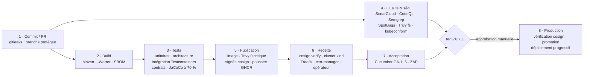

# CLAUDE.md — Collector.shop (Java 21 · Spring Boot 4)

Ce fichier est la référence du projet pour Claude Code **et** pour le développeur.
Il permet de reconstruire le projet de A à Z : contexte, consignes, grille,
architecture, contrats, sécurité, tests, CI/CD, déploiement, exploitation,
feuille de route et modèles de code.

| Partie | Contenu | Quand la lire |
|---|---|---|
| **A** | Règles de travail, décisions actées | Toujours, avant toute action |
| **B** | Contexte, consignes, grille, décisions de soutenance, slides à corriger | Avant de concevoir quoi que ce soit |
| **C** | Architecture (services, hexagonale, bus), stack, structure, contrats, photos | Avant d'écrire du code |
| **D** | Sécurité, RGPD, observabilité, tests, CI/CD, déploiement, exploitation | Avant de toucher à l'infra |
| **E** | Expérimentation, charge, remédiation, démonstration | Phases 2 et 3 |
| **F** | Feuille de route : ordre des étapes, calé sur le release plan (septembre → avril) | Pour savoir quoi faire ensuite |
| **G** | Modèles de code | Au moment d'écrire le fichier concerné |

> Une fois le squelette généré (semaines 1 à 3), déplacer la partie G dans
> `docs/modeles.md` : le code réel devient la référence et ce fichier s'allège.

Documents de l'école (dans `doc/`, **non versionnés**, cf. A5) :
`contexte_Collector.pdf` (sujet), `Consignes eval bloc Superviser et Assurer Développment.pdf`,
`Grille_eval_bloc_INFMAALSIA2V_Superviser_dev_apps_logicielles.xlsx`,
`Soutenance_Collector.pdf` (support de soutenance déjà rédigé, 28 slides).

---

# PARTIE A — Règles de travail

## A1. Répartition du travail

| Qui | Quoi |
|---|---|
| **L'utilisateur** | Code métier du **catalogue** (US-014 : articles, photos, prix, application du verdict), front Vue **minimal**. Il doit pouvoir expliquer et défendre ce code devant le jury |
| **Claude** | **`controle-service` en entier** (règle des 3 écarts-types, cas d'usage, adaptateurs, tests — G8) ; squelette Maven, bibliothèque de contrats (`collector-messaging`), adaptateurs techniques transverses du catalogue (outbox, publication confirmée, stockage S3, sécurité, erreurs), infrastructure (PostgreSQL, Flyway, RabbitMQ, Keycloak, stockage objet), compose, Kubernetes, CI/CD, observabilité, tests d'acceptation Gherkin, tests d'architecture, tests de charge, documentation, contrats d'API et d'événements, **revues de code** |

Pour le code métier du catalogue, Claude fournit des **exemples documentés**
(modèles : `GET /api/v1/categories` et `POST /api/v1/pings`, partie G), les
contrats, les scénarios d'acceptation, et relit. Il n'y implémente un cas d'usage
que si l'utilisateur le demande explicitement.

**Guide de référence pour écrire une user story** :
[`docs/guide/exemple-US-021-centres-interet.md`](docs/guide/exemple-US-021-centres-interet.md)
— démarche complète (backlog → contrat → Gherkin → domaine → cas d'usage →
adaptateurs → tests → PR) sur US-021, avec le code de chaque couche et la
transposition à US-014. L'utilisateur l'implémente lui-même en échauffement.

`controle-service` est écrit par Claude **à la demande de l'utilisateur**. Comme
il sera présenté au jury, Claude le documente pour qu'il puisse être défendu :
`services/controle-service/README.md` (règle, choix, cas limites, tests) et
commentaires sur le *pourquoi* ; il le **parcourt avec l'utilisateur** une fois
livré.

## A2. Règles non négociables

1. **Contrat d'abord.** Toute route est décrite dans `docs/api/openapi.yaml`, tout
   événement dans `docs/events.md` et son schéma JSON, *avant* le code.
2. **Architecture hexagonale vérifiée** (§C3) : le domaine ne dépend d'aucun
   framework ; ArchUnit fait échouer le build sinon.
3. **Aucun secret dans le dépôt ni dans une image**, aucun secret avec valeur par
   défaut (`${DB_PASSWORD}` sans `:valeur`). Un secret absent empêche le démarrage.
   Secrets locaux : `.env` (ignoré par git), modèle : `.env.example`.
4. **Écriture + événement = outbox.** Un cas d'usage publie ses événements par le
   port `DomainEventPublisher`, implémenté par l'outbox dans **la même
   transaction** que la donnée. Jamais de `RabbitTemplate` hors des adaptateurs.
5. **Aucun détail technique vers le client.** Erreurs ProblemDetail (RFC 9457)
   avec un `code` stable ; le détail (SQL, pile) part dans les logs.
6. **Moindre privilège partout** : rôle PostgreSQL et clé S3 dédiés par service,
   conteneurs non-root en lecture seule, NetworkPolicies, jetons de 5 minutes.
7. **Pas de logiciel en fin de vie** : vérifier la maintenance de chaque brique
   avant de l'adopter (cf. §C5 : trois cas déjà rencontrés).
8. **Chaque comportement livré est testé** et le pipeline reste vert.
9. **Cohérence slides ↔ code.** Le jury lira le code. Toute différence avec
   `doc/Soutenance_Collector.pdf` est **signalée à l'utilisateur** (§B6).
10. **Honnêteté sur la vérification.** Ne jamais affirmer que quelque chose marche
    sans l'avoir exécuté ; dire ce qui n'a pas pu être vérifié.
11. **Git** : ne jamais committer ni pousser sans demande explicite. Messages en
    français, format conventionnel (`feat:`, `fix:`, `ci:`, `docs:`, `test:`,
    `chore:`, `refactor:`).
12. **Toute décision structurante = un ADR** dans `docs/adr/` (§C12).

## A3. Conventions

- **Langue** : identifiants en anglais ; commentaires, documentation, logs métier
  et Gherkin en français.
- **Java 21** : `record` pour les objets de valeur, DTO et événements ; injection
  par constructeur ; champs `final` ; **pas de Lombok** (moins de magie, code
  lisible par le jury) ; pas de MapStruct (conversions explicites
  `toDomain()` / `from(...)`). `Optional` en retour uniquement.
- **Montants** en centimes `long` ; **dates** en `Instant` (UTC) ; **identifiants**
  en `UUID` ; **horloge** injectée (`java.time.Clock`) pour tester le temps.
- **JSON** en `snake_case`.
- **Packages** : par fonctionnalité, hexagone à l'intérieur (§C3).
- **Commentaires** : le *pourquoi* (décision, piège), pas le *quoi*.
- **Scripts et commandes** : Bash, commun aux deux machines (Git Bash sous
  Windows, zsh/bash sous macOS) et à la CI. Équivalent PowerShell donné seulement
  quand la syntaxe diffère (chargement du `.env`, fichier `hosts`).

## A4. Définition de « terminé »

Contrat à jour · règles A2/A3 respectées · tests unitaires, d'intégration,
d'architecture et scénario Gherkin verts · pipeline vert · `docs/` à jour · ADR si
décision · écarts avec les slides signalés.

## A5. Environnement de l'utilisateur

- **Deux machines** : un PC **Windows 11** (PowerShell, Git Bash) et un **Mac**.
  Tout doit fonctionner à l'identique sur les deux : scripts Bash, fins de ligne
  LF (`.gitattributes`), aucun chemin absolu ni commande propre à un système dans
  le code et les scripts.
- **IDE : IntelliJ IDEA** (l'édition Community suffit). CLion, utilisé pour la
  version C++, ne gère pas Java.
- **Docker Desktop** : déjà installé et fonctionnel (il servait à la version C++).
  Il est indispensable pour Testcontainers, compose et Minikube.
- À installer pour Java et Kubernetes :

  | | Windows | macOS |
  |---|---|---|
  | JDK 21 | `winget install EclipseAdoptium.Temurin.21.JDK` | `brew install --cask temurin@21` |
  | Outils | `winget install Kubernetes.kubectl Kubernetes.minikube Helm.Helm` | `brew install kubectl minikube helm` |

- **Mac Apple Silicon (arm64)** : les images de base retenues existent en arm64.
  Les images construites par la CI (amd64) tourneraient en émulation sur le Mac :
  la CI construit donc en **multi-architecture** (`linux/amd64,linux/arm64`, §G12).
- **Moins de 16 Go de RAM** → profils allégés (§D6) : compose au quotidien,
  Minikube allégé pour la démo, configuration complète seulement dans la CI (kind).
  Limiter la mémoire de Docker : `%UserProfile%\.wslconfig` (`[wsl2]`
  `memory=8GB`) sous Windows, réglages *Resources* de Docker Desktop sous macOS.
- **Dépôt GitHub public** : SonarCloud et CodeQL gratuits, runners 4 vCPU / 16 Go.
  Conséquence : `doc/` (documents de l'école, grille, slides) est dans
  `.gitignore` — ne pas les publier sans l'accord de l'école.

## A6. Décisions actées (journal)

| Date | Décision | Référence |
|---|---|---|
| 2026-09-30 | Refonte en **Java 21 / Spring Boot 4.x** (abandon de C++/Drogon) | ADR 0002 |
| 2026-09-30 | **RabbitMQ** comme bus d'événements | §C4, ADR 0001 |
| 2026-09-30 | **Architecture hexagonale** (ports et adaptateurs) + ArchUnit | §C3, ADR 0003 |
| 2026-09-30 | Déploiement : **Minikube** (démo) + **kind** éphémère en CI (recette) | §D5-D6, ADR 0009 |
| 2026-09-30 | `controle-service` écrit **par Claude** (catalogue métier et front minimal par l'utilisateur) | A1 |
| 2026-09-30 | **Photos** incluses dans US-014 : stockage objet S3, URL pré-signées | §C11, ADR 0008 |
| 2026-09-30 | Dépôt **public** ; machine **< 16 Go** ; deux machines (Windows, Mac) | A5 |
| 2026-09-30 | Calendrier : **release plan septembre → avril, jalon au 31 décembre** (deck à 31 slides) | F |
| 2026-09-30 | **Référence fonctionnelle = README** (US-001 à US-037, US-014 avec photos et CA-6) ; le deck est renuméroté | Encadré partie B |
| 2026-09-30 | ~~Paiement en sandbox et chat protégé dans le POC~~ **remplacé** (voir ligne suivante) | §C13 |
| 2026-09-30 | **POC réduit à 3 US liées** : US-014 (imposée), **US-033** (revue admin), **US-029** (suivre un article, notification de variation de prix) ; paiement et chat **hors POC** ; **`notification-service`** (3e service) ; écart avec le deck à signaler | README §6, ADR 0015 |
| 2026-09-30 | Stockage objet : **Garage** (MinIO n'est plus distribué) | §C5, ADR 0008 |
| 2026-09-30 | Relais outbox par **bail**, sans transaction pendant l'envoi ; **aucun ordre garanti** | G3, ADR 0005 |

---

# PARTIE B — Contexte, consignes, grille

> **⚠ Référence fonctionnelle : le [`README.md`](README.md)** (décision du
> 30/09/2026). Sa numérotation — **11 épopées, US-001 à US-037, mise en vente =
> US-014 avec photos et CA-1 à CA-6** — est celle de ce fichier, du guide, du
> Gherkin et du code. Il est plus complet que le deck (acteurs, cas d'utilisation,
> interprétations du besoin) et porte la spécification la plus récente (photos,
> CA-6).
>
> Le **deck de soutenance à jour (31 slides)** — 10 épopées, US-01 à US-38, mise
> en vente = US-10 à US-13, cinq critères sans photo — est **renuméroté pour
> s'aligner sur le README** : deux slides de backlog, la slide des critères
> d'acceptation (ajouter photos et CA-6) et quelques mentions (§B6). Il reste la
> référence pour deux sujets :
>
> | Sujet | Décision du deck | État dans ce dépôt |
> |---|---|---|
> | Périmètre du POC | **21 US sur 38**, dont paiement en sandbox et chat protégé | **Écart assumé : 3 US liées (US-014, US-033, US-029)**, paiement et chat hors POC (README §6, ADR 0015) ; deck à mettre à jour |
> | Calendrier | **Release plan septembre → avril, jalon au 31 décembre** | Partie F = ordre des étapes ; dates à reporter |
>
> `doc/Soutenance_Collector.pdf` (28 slides) est l'**ancienne** version ; les
> numéros de slides cités en §B6 sont les siens.

## B1. L'évaluation

- **Bloc** : *Superviser et assurer le développement des applications
  logicielles* (INFMAALSIA2V, titre MAALSI, CESI). **Travail individuel.**
- **Rôle joué** : Lead Developer de l'équipe IT de la start-up Collector.
- **Soutenance** : 20 min de présentation + 15 min d'échange. Public considéré
  comme *spécialistes du développement* : vocabulaire précis, aucun « je sais
  faire mais pas expliqué ». Démo préparée + **vidéo de secours**.
- **Compétences évaluées** : élaborer le processus d'assurance qualité (qualité,
  politique de tests, politique de sécurité) · piloter le développement et le
  déploiement (chaîne de livraison continue, montée en compétences, mise en
  production disponible et scalable) · expertise (bac à sable, POC, applications
  complexes).

## B2. Travail demandé (consignes, 3 phases)

**Phase 1 — Structuration du processus de développement**
- 1.1.1 **Quatre indicateurs** de qualité (ISO 25010), en justifiant comment leur
  suivi évite l'accumulation de dette technique.
- 1.1.2 **Cycle de vie DevSecOps** : mesures de sécurité à chaque étape ;
  **schéma détaillé du CI/CD** ; tests automatisés (types, outils) ; montrer
  comment les outils mesurent les indicateurs.
- 1.1.3 **Cartographie des compétences** + **une action de formation** (profils
  réalistes, pas de « moutons à 5 pattes »).

**Phase 2 — Développement et déploiement (POC)**
- 1.2.1 Exigences fonctionnelles reformulées ; fonctionnalité implémentée décrite
  en **backlog** (user story + critères d'acceptation) ; **schéma d'architecture
  technique** intégrant la sécurité.
- 1.2.2 **Expérimentation en bac à sable** d'une technologie *plateforme*
  (middleware, sécurité, orchestrateur, observabilité…) : environnement, étapes
  reproductibles, difficultés, limites, résultats justifiant l'adoption.
  *Non valables* : tester un langage, la communication front/back, des tests
  unitaires locaux, un composant de framework (MVC, ORM, REST).
- 1.2.3 **Au moins une fonctionnalité métier** respectant le backlog, prouvée par
  des tests d'appel ou d'acceptation ; respect de l'architecture ; **solution de
  sécurité** (HTTPS/TLS, authentification/autorisation — Keycloak —, détection de
  vulnérabilités) ; **une composante d'observabilité** ; **pipeline CI/CD avec au
  moins 2 types de tests** qui mesurent les métriques ; **démonstration de la
  montée en charge** (JMeter ou Siege) pendant la soutenance. Le déploiement en
  (pré)production n'est pas obligatoire.

**Phase 3 — Plan de remédiation** : analyser résultats de tests et métriques
(notamment la charge), identifier les vulnérabilités, proposer des actions
**priorisées et justifiées**.

## B3. Grille d'évaluation — viser 5/5 partout

Dix critères notés 5 / 4 / 2 / 1. Moyenne ≥ 4,6 → **A**.

| # | Critère | Ce que le 5/5 exige | Preuve dans le projet |
|---|---|---|---|
| 1 | Protocole d'expérimentation | Technologies testées **et leurs interactions**, environnement spécifié, étapes reproductibles, difficultés, résultats qui **valident l'adoption** (pas un simple guide d'installation) | `docs/experimentation/rabbitmq-kubernetes.md` (§E1) |
| 2 | Qualité technique du POC | Valide **découpage, communication interservices, sécurité, hébergement, orchestration** ; documenté | 2 services + bus + Keycloak + stockage objet + K8s ; `README.md`, `docs/ARCHITECTURE.md`, ADR |
| 3 | Fonctionnalité métier | Répond au besoin exprimé | US-014 avec photos (CA-1 à CA-6), puis US-033 et US-029 (périmètre réduit à 3 US liées, README §6), scénarios d'acceptation verts |
| 4 | Processus CI/CD | **Schématisé**, conforme, et le POC intègre la plateforme **telle que décrite** | Workflows §D5, schéma identique à la slide 9, recette réellement déployée (kind) |
| 5 | Environnement d'exécution | Environnement **managé**, **disponibilité et montée en charge démontrées** | Kubernetes (Minikube + kind), HPA, PDB, réplicas, suppression de pod en direct, SLO mesurés (§D7) |
| 6 | Indicateurs qualité | ≥ 4 indicateurs **mesurés**, faisant ressortir des **axes d'amélioration** de la dette | `docs/rapport-qualite.md` (§D4.2), tendance nocturne |
| 7 | Processus de test | Formalisé : types, outils, **parties prenantes** ; ≥ 2 types appliqués **et passants** | `docs/tests.md` (§D4) : 6 types dans le pipeline |
| 8 | Remédiation sécurité | Plan **priorisé et justifié** ciblant les risques critiques ; **≥ 2 bonnes pratiques** dans le POC | `docs/remediation.md` (§E3), STRIDE (§D1) |
| 9 | Compétences | Compétences recensées, expertises à acquérir, **formation détaillée** | Slides 11-12 (à adapter, §B6) |
| 10 | Présentation | Schémas lisibles, démo préparée, discours structuré, vocabulaire précis | Script §E4 + vidéo |

## B4. L'entreprise et le besoin (sujet)

**Collector** : start-up française (5 ans, ex-événementiel), levée de fonds par
crowdfunding pour lancer **Collector.shop**, marketplace C2C d'objets de
collection « du quotidien » (baskets édition limitée, posters dédicacés,
figurines Star Wars, cassettes V2000…). Hors segment : luxe, brocante classique.
Équipe IT : 1 Lead Dev + 2 développeurs confirmés (5 ans), recrutements possibles.
SI actuel minimal : Office 365, Power BI, Exchange, Adobe CC, postes Windows 11,
wifi de l'incubateur, site vitrine WordPress chez un hébergeur français.

**Exigences fonctionnelles** (reformulées)
- Profils **acheteur** / **vendeur** (cumulables) + **admin** (back-office :
  catégories, suppression d'articles ou de vendeurs hors charte, modération).
- Catalogue consultable **sans compte** ; inscription obligatoire pour acheter ou
  vendre.
- Espace personnel : achats/ventes en cours, historique, notation mutuelle,
  notifications, **chat** acheteur-vendeur (modérable).
- **Recommandations** selon centres d'intérêt (V2 : aussi selon le parcours).
- **Notifications** : nouvel article particulier ou correspondant à un centre
  d'intérêt ; type réglable ; dans l'espace + par e-mail.
- **Paiement par carte uniquement, via la plateforme** ; commission **5 %** ;
  interdiction d'échanger des coordonnées (e-mail, téléphone).
- Plusieurs **boutiques** par vendeur, identifié comme particulier.
- Article : **photos**, description précise, prix, frais de port ; **mis en vente
  après contrôle, le plus automatisé possible**.
- **Variation de prix** : collectée, notifiée aux acheteurs intéressés **et** au
  composant back-office anti-fraude.
- Intégration d'un outil de **détection de fraude** (interne ou acheté : non tranché).
- **Internationalisation** et **accessibilité**.
- Publicités ciblées automatisées sur sites partenaires.

**Exigences non fonctionnelles** : architecture évolutive (enchères, live,
bot avant-vente, analyse des ventes à ajouter vite) ; **la sécurité est
l'exigence de premier plan** (transactions financières).

**Acteurs, cas d'utilisation, backlog complet (E1 à E11, US-001 à US-037) et
interprétations du besoin** : [`README.md`](README.md), sections 1 à 5. C'est la
référence fonctionnelle ; toute nouvelle story y est ajoutée avant d'être codée.

## B5. Décisions présentées en soutenance (à respecter)

**ISO/IEC 25010:2023 — 4 caractéristiques prioritaires** : Sécurité,
Maintenabilité, Flexibilité, Performance & Fiabilité. Écartées pour la V1 :
Compatibilité, Sûreté, Capacité d'interaction (traitées au niveau produit).

**4 métriques, 4 seuils bloquants** (outillage Java) :

| # | Métrique | ISO 25010 | Outils | Seuil bloquant | Fréquence |
|---|---|---|---|---|---|
| 1 | Couverture de branches | Maintenabilité, Capacité fonctionnelle | JUnit 5 + JaCoCo (unitaires + intégration fusionnés) ; PIT en complément | ≥ 70 % global, ≥ 80 % code nouveau (Sonar) | Chaque commit |
| 2 | Vulnérabilités critiques (code, dépendances, image) | Sécurité | CodeQL, Semgrep, SpotBugs + FindSecBugs, Trivy (fs + image), OWASP ZAP | 0 critique, 0 haute non justifiée | Chaque commit |
| 3 | Latence p95 + taux d'erreur sous charge nominale | Performance, Fiabilité | JMeter + Prometheus/Grafana | p95 < 300 ms, erreurs < 1 % | **Nocturne** (workflow planifié) + avant livraison |
| 4 | Ratio de dette + complexité cognitive | Maintenabilité, Flexibilité | SonarCloud (quality gate) ; ArchUnit pour les règles d'architecture | ratio < 5 %, complexité / méthode < 15 | Chaque commit |

Limite assumée présentée slide 7 (« un seuil trop haut se contourne : tests sans
assertion ») : **PIT** (tests de mutation, rapport non bloquant) la mesure.

**Fonctionnalité métier : US-014 — Mise en ligne d'un article avec contrôle automatisé**
> En tant que vendeur authentifié, je veux mettre en ligne un article avec son
> prix **et ses photos**, afin qu'il soit proposé à la vente après un contrôle
> automatique de conformité.

| CA | Critère |
|---|---|
| CA-1 | Vendeur authentifié + brouillon valide **avec au moins une photo** → à la soumission, statut `EN_CONTROLE` et `article.submitted` publié |
| CA-2 | Prix cohérent avec la fourchette de la catégorie → `PUBLIE` en **moins de 2 s**, sans intervention humaine |
| CA-3 | Prix à **plus de 3 écarts-types** de la médiane de la catégorie → `EN_REVUE` + alerte vers l'anti-fraude |
| CA-4 | Article publié dont le vendeur modifie le prix → `price.changed` publié, consommé **par la notification et par l'anti-fraude** |
| CA-5 | Non authentifié → **401** ; vendeur modifiant l'article d'un autre → **403** |
| CA-6 | *(nouveau)* Brouillon **sans photo valide** soumis → **422** `photo_required`, l'article reste `BROUILLON` |

Périmètre du prototype : **trois US liées** (README §6, ADR 0015) — US-014 ci-dessus,
**US-033** (revue admin) et **US-029** (suivre un article). Le paiement en sandbox et le
chat sont hors POC. Dans le deck, US-014 apparaît sous les numéros US-10 à US-13 : c'est
le deck qui est renuméroté.

**US-033 — Traiter les articles en revue.** *En tant qu'administrateur, je veux valider ou
rejeter un article que le contrôle a mis en revue, afin de ne publier que des annonces saines.*

| CA | Critère |
|---|---|
| CA-1 | Admin : `GET /admin/reviews` liste les articles `EN_REVUE` (score d'anomalie, motif), plus anciens d'abord |
| CA-2 | Admin valide un article `EN_REVUE` → `PUBLIE` et `article.reviewed` publié |
| CA-3 | Admin rejette un article `EN_REVUE` avec un motif obligatoire → `REJETE` et `article.reviewed` publié ; le vendeur voit le motif dans `/me/articles` |
| CA-4 | Article qui n'est pas `EN_REVUE` → **409** `invalid_status` ; article inconnu → 404 |
| CA-5 | Sans jeton → **401** ; sans le rôle `admin` → **403** |

**US-029 — Suivre un article.** *En tant qu'acheteur, je veux suivre un article et être
prévenu quand son prix change, afin de ne pas manquer une bonne affaire.*

| CA | Critère |
|---|---|
| CA-1 | Acheteur suit un article `PUBLIE` (`PUT /articles/{id}/follow`, idempotent) → `follow.changed` publié ; article non publié → 404 |
| CA-2 | `DELETE /articles/{id}/follow` : il ne suit plus, `follow.changed` (following=false) publié |
| CA-3 | Le vendeur change le prix (CA-4 d'US-014) → chaque suiveur reçoit une notification (ancien et nouveau prix) dans `GET /me/notifications` |
| CA-4 | Deux `price.changed` reçus inversés ou en double → une seule notification, celle du dernier prix (`aggregate_version`) |
| CA-5 | L'acheteur marque une notification lue (`POST /me/notifications/{id}/read`) ; il ne voit jamais celles des autres |
| CA-6 | Sans jeton → 401 ; sans le rôle `acheteur` → 403 |

**Autres décisions** : bus de messages (ajouter une fonctionnalité = ajouter un
consommateur) ; Keycloak OIDC (Authorization Code + PKCE, JWT RS256) ;
PostgreSQL 16 (ACID, JSONB) ; Kubernetes, hébergement européen ; observabilité
par **collecte de métriques** + logs JSON ; expérimentation **RabbitMQ en cluster
3 nœuds sur Minikube** (files quorum, confirms, perte d'un nœud) ; formation CKAD
(3 j) + module OWASP (2 j) + dojo sécurité mensuel ; recrutement prioritaire d'un SRE.

## B6. Slides à mettre à jour

Le support a été écrit pour une version C++/Drogon. À corriger avant la soutenance :

| Slide | Aujourd'hui | À mettre |
|---|---|---|
| 6, 10 | gcov/lcov, GoogleTest, clang-tidy, audit Conan | JaCoCo, JUnit 5, PIT, SpotBugs/FindSecBugs, Semgrep, CodeQL, Trivy, ArchUnit |
| 7 | « Limite assumée : tests sans assertion » | Ajouter : mesurée par PIT (score de mutation) |
| 8 | Conan lockfile, `-Werror`, ASan/UBSan | Versions figées + Maven Enforcer + SBOM CycloneDX, `-Xlint:all -Werror`. ASan/UBSan sans objet (JVM à mémoire sûre) : c'est un argument |
| 9 | Build CMake + Conan ; recette théorique | Build Maven ; recette **réellement déployée** sur kind ; production = promotion de l'image signée après approbation |
| 11 | « Backend C++ moderne » couvert | « Java 21 / Spring Boot » couvert (Lead + 2 confirmés) |
| 15, 16 | Pas de photos ; CA-1 à CA-5 | Photos dans le périmètre, flux brouillon → soumission, **CA-6** |
| Deck à 31 slides : 2 slides de backlog + slide des critères | 10 épopées, US-01 à US-38, mise en vente = US-10 à US-13, 5 critères sans photo | Numérotation du README : 11 épopées, US-001 à US-037, mise en vente = **US-014**, photos et **CA-6** ; périmètre des 21 US réexprimé |
| 17 | svc-catalogue C++ ; **Ingress NGINX** | Java 21 / Spring Boot ; **Traefik** (ingress-nginx n'est plus maintenu, §C5) ; stockage objet S3 ; contrôle en service séparé |
| 18 | C++ / Drogon ; « point le plus discutable » | Java 21 / Spring Boot 4, **alternative écartée : C++/Drogon** (écosystème web, sécurité mémoire, recrutement) ; ajouter la ligne « architecture hexagonale » et la ligne « stockage objet » |
| 20 | « Client AMQP sans reconnexion » ; valeurs `[ … ]` | Spring AMQP reconnecte seul : difficultés réelles ; mesures réelles (§E1) |
| 21 | Validation JWT « dans le service C++ » ; Ingress NGINX | Spring Security Resource Server ; Traefik |
| 22 | `/metrics` par service C++ | Actuator + Micrometer ; SLO et alertes |
| 23 | Démo depuis l'interface Vue | Front minimal (connexion, mise en vente avec photo, statut) |
| 24 | Valeurs `[ … ]` | Mesures réelles (§E2) |
| 26, 27 | Dépendances C++ ; « isoler le client AMQP » | Risques réels issus des scans (dont photos : EXIF, antivirus) ; retirer ce qui ne s'applique plus |

## B7. Améliorations proposées par rapport au support d'origine

Le support a été conçu pour la version C++. Ces changements ne corrigent pas une
erreur : ils rendent le dossier plus solide face au jury. Décidés, sauf mention.

| # | Sujet | Avant | Proposé | Gain (critère) |
|---|---|---|---|---|
| 1 | Backlog | Trois numérotations (deck, README, CLAUDE.md) | **Une seule, celle du README**. Dans le deck : renuméroter les deux slides de backlog et la slide des critères d'acceptation (US-10 à US-13 → US-014, ajouter photos et CA-6). Vérifier que chaque US porte priorité MoSCoW, estimation et critères, et que la **Definition of Ready / Done** est affichée | Maîtrise du backlog (3, 10) |
| 2 | Pipeline | Recette théorique ; image publiée après les tests | **Construire une fois, promouvoir** : l'image est signée et poussée à l'étape 5, la recette **vérifie la signature** puis déploie ce digest, la production promeut le même digest. La chaîne de confiance est testée à chaque exécution | CI/CD conforme au schéma (4), sécurité (8) |
| 3 | Architecture | Couches implicites | Hexagonale + ArchUnit ; slide 5 « Flexibilité » argumentée par les 3 remplacements d'adaptateurs prévus | Qualité technique (2), indicateurs (6) |
| 4 | Observabilité | Une composante (métriques) | Métriques **et** logs corrélés par identifiant de trace (quasi gratuit avec Spring Boot) ; SLO mesurés | Disponibilité démontrée (5) |
| 5 | Formation | CKAD + OWASP + dojo | Ajouter un **atelier d'une journée « hexagonale et DDD »** (nouveau pour l'équipe) et Spring Security OAuth2 dans le module sécurité ; efficacité mesurée par les violations ArchUnit et le ratio de dette Sonar | Compétences (9) |
| 6 | Phase 3 | Saturation du pool de connexions | Point spécifique à Java : **threads virtuels + pool Hikari de 10** → la contention se déplace vers le pool ; à mesurer pendant la charge et à présenter comme risque de disponibilité | Remédiation fondée sur des mesures (8) |
| 7 | Tests | Couverture seule | PIT (mutation) pour la limite « tests sans assertion » de la slide 7 ; tests de contrat des événements | Processus de test (7) |
| 8 | Démo | Parcours vendeur seul | Ajouter US-021 (centres d'intérêt, exemple guidé) si elle est livrée : montre qu'une 2e fonctionnalité réutilise le même socle en peu de code | Fonctionnalité métier (3), évolutivité |

---

# PARTIE C — Architecture, stack, contrats

## C1. Vue d'ensemble

```
 Navigateur (Vue 3 · TS · vue-i18n · RGAA)
    │ HTTPS · OIDC Authorization Code + PKCE · JWT RS256          │ PUT photo (URL pré-signée)
    ▼                                                              ▼
 ┌───────────────────────────── Kubernetes (namespace collector) ─────────────────────────────┐
 │ Traefik (TLS cert-manager · HSTS · rate limiting)                                           │
 │  api.collector.local ─► catalogue-service ──JWKS──► Keycloak ◄─ auth.collector.local        │
 │                          │   │    │ HEAD/pré-signature                                      │
 │        JDBC catalogue_app│   │    └──────────────► Stockage objet S3 ◄─ s3.collector.local  │
 │                          ▼   │ outbox → relais (publisher confirms)                         │
 │                   PostgreSQL │                                                              │
 │                          ▲   ▼                                                              │
 │  SELECT stats            │  RabbitMQ (quorum, DLX) ──article.submitted──► controle-service │
 │  (controle_app)          └──────────────────────────────────────────────── │                │
 │                              ▲ article.checked · fraud.alert ◄─────────────┘                │
 │ Prometheus ◄─ /actuator/prometheus (8081) · rabbitmq:15692 · postgres-exporter ─► Grafana   │
 └─────────────────────────────────────────────────────────────────────────────────────────────┘
```

**Flux US-014** : ① le vendeur crée un **brouillon** (`POST /api/v1/articles`) →
② demande une URL d'envoi par photo et l'utilise directement vers le stockage
objet (le binaire ne transite jamais par l'API) → ③ **soumet** le brouillon :
le service vérifie les photos (HEAD : existence, type, taille), passe l'article
`EN_CONTROLE` et écrit `article.submitted` dans l'outbox, même transaction →
④ le relais publie (confirm) → ⑤ controle-service lit les stats de la
catégorie, calcule le score → ⑥ publie `article.checked` (+ `fraud.alert`) →
⑦ catalogue applique le verdict, de façon idempotente.

## C2. Découpage en services (microservices)

**Contextes métier** (bounded contexts, DDD) et services cibles :

| Contexte | Responsabilité | Service cible | Dans le POC |
|---|---|---|---|
| Catalogue | Articles, catégories, photos, prix, boutiques | `catalogue-service` | ✅ |
| Conformité et fraude | Contrôle automatique, score d'anomalie, alertes | `controle-service` (+ outil externe éventuel) | ✅ |
| Identité | Comptes, rôles, authentification | Keycloak | ✅ |
| Notification | Abonnements, notifications de l'espace (US-029) | `notification-service` | ✅ (e-mail : V2) |
| Paiement | Commande, paiement par PSP, commission 5 % | `payment-service` + PSP certifié | ❌ hors POC (§C13, conception conservée) |
| Échanges | Chat acheteur-vendeur, modération | `chat-service` (WebSocket) | ❌ hors POC (§C13, conception conservée) |
| Recommandation | Centres d'intérêt, parcours | `reco-service` | ❌ |
| Back-office | Catégories, modération, chartes | Interface admin (rôle Keycloak) | ❌ |

**Pourquoi 2 services dans le POC et pas 1** : le contrôle a un cycle de vie
propre (il peut être remplacé par un outil acheté), une charge différente
(pics de CPU aux mises en ligne) et doit pouvoir tomber sans empêcher les
vendeurs de soumettre (les articles attendent `EN_CONTROLE`). **Pourquoi pas
plus** : chaque service coûte en exploitation ; avec 3 à 5 développeurs, on
découpe quand un contexte a une raison de vivre seul, pas par principe.
**Pourquoi pas un monolithe modulaire** : il serait plus simple, mais n'offre ni
déploiement ni mise à l'échelle indépendants, et ne permet pas d'intégrer un
outil anti-fraude externe par contrat (ADR 0004).

**Principes** :
- Communication **asynchrone par événements** entre services ; **REST**
  uniquement du front vers les services.
- **Base par service** comme cible. Compromis assumé du POC : controle-service
  **lit** la vue `category_price_stats` du catalogue (rôle en lecture seule, ADR
  0006) ; en V2, il maintient son propre modèle de lecture alimenté par les
  événements. Grâce à l'hexagonale, ce changement = **un adaptateur à remplacer**.
- Bibliothèque partagée **limitée aux contrats** (`collector-messaging` :
  enveloppe, types, topologie, schémas, publication confirmée). Aucun code
  métier partagé.
- Chaque service est déployable, versionné et scalable indépendamment.

**Choix d'infrastructure de services** :

| Besoin | Choix | Écarté |
|---|---|---|
| Point d'entrée | **Traefik** (Ingress + Middlewares : TLS, rate limiting, en-têtes) | Passerelle API Spring Cloud Gateway : pas de logique de routage métier en V1 ; à reconsidérer pour un BFF |
| Découverte de services | DNS Kubernetes | Eureka / Consul : redondant avec Kubernetes |
| Configuration | Variables d'environnement, ConfigMaps, Secrets (12-factor) | Spring Cloud Config : un serveur de plus pour rien |
| Résilience | Délais explicites partout (Hikari, AMQP, S3, JWKS), rejeu par le broker, lettres mortes ; disjoncteur Resilience4j sur les appels synchrones sortants (S3, futur PSP) | Service mesh (Istio) : trop lourd pour la V1, cité en remédiation (mTLS) |

## C3. Architecture interne : hexagonale (ports et adaptateurs)

**Décision** (ADR 0003) : chaque service suit l'architecture hexagonale, avec des
règles pragmatiques pour en limiter le coût, et ArchUnit pour la faire respecter.

| Pour | Contre |
|---|---|
| Domaine testable sans Spring ni base : tests rapides, couverture métier réelle (métrique 1) | Plus de classes : entité JPA séparée du modèle, conversions |
| Adaptateurs remplaçables — **trois remplacements sont déjà prévus** : outil anti-fraude interne ou acheté, stockage Garage (local) → stockage objet cloud, stats en base partagée → modèle de lecture propre | Courbe d'apprentissage pour l'équipe |
| Montée de version de framework isolée (le projet vient de changer de langage et de version majeure) | Risque de sur-ingénierie sur le CRUD simple |
| Architecture **vérifiable** en CI (ArchUnit) : garde-fou de la maintenabilité (métrique 4) | |

Écartées : **couches classiques avec JPA dans le domaine** (rapide, mais domaine
couplé au framework et non testable seul) ; **clean architecture stricte** avec
une interface de port entrant par cas d'usage (cérémonie sans gain pour 3 à 5
développeurs).

**Règles pragmatiques**
1. Un hexagone **par fonctionnalité** (package-by-feature), pas un hexagone global.
2. **`domain`** : Java pur (records, règles, exceptions métier, événements). Aucun
   import Spring, JPA, Jackson, AMQP, AWS.
3. **`application`** : cas d'usage = classes concrètes (le port entrant est la
   classe elle-même) ; ports sortants = interfaces dans `application/port`.
   Seules annotations Spring tolérées : `@Service`, `@Transactional`.
4. **`adapter/in/*`** (web, messaging) appellent les cas d'usage ;
   **`adapter/out/*`** (persistence, outbox, storage, messaging) implémentent les
   ports. Un adaptateur n'en appelle jamais un autre.
5. L'entité JPA vit dans `adapter/out/persistence`, avec `toDomain()` /
   `fromDomain()` explicites.
6. L'autorisation (rôle, **propriété**) se décide dans le cas d'usage à partir
   d'une identité passée en paramètre (`Member`, record du domaine), pas dans le
   contrôleur. La conversion du jeton (`Jwt`, classe Spring Security) en `Member`
   vit dans l'**adaptateur web** (`Members.from(jwt)`) : une méthode
   `Member.from(Jwt)` dans le domaine ferait échouer la règle ArchUnit
   `domainIsPureJava`.

**Arborescence type (catalogue-service)**

```
com.collector.catalogue
├─ article/
│  ├─ domain/          Article, ArticleStatus, Photo, ContactInfoPolicy, ArticleSubmitted, PriceChanged, exceptions
│  ├─ application/     CreateDraft, RequestPhotoUpload, SubmitArticle, ChangePrice, ApplyVerdict, GetArticle, ListArticles
│  │  └─ port/         ArticleRepository
│  └─ adapter/
│     ├─ in/web/          ArticleController, *Request, *Response
│     ├─ in/messaging/    ArticleCheckedListener
│     └─ out/persistence/ ArticleEntity, PhotoEntity, ArticleJpaRepository, ArticlePersistenceAdapter
├─ category/           (même forme — exemple de référence G2)
├─ ping/               (démonstration outbox — G3)
└─ shared/
   ├─ domain/          DomainEvent, DomainException, Member
   ├─ application/port/ DomainEventPublisher, PhotoStorage, MemberDirectory
   ├─ adapter/out/outbox/   OutboxEvent, OutboxEventRepository, OutboxDomainEventPublisher, OutboxStore, OutboxRelay
   ├─ adapter/out/storage/  S3PhotoStorage
   ├─ adapter/out/persistence/ MemberJdbcAdapter
   ├─ adapter/in/web/       ApiExceptionHandler, Members (Jwt → Member)
   └─ config/          SecurityConfig, KeycloakRealmRoleConverter, StorageConfig, ClockConfig
```

**controle-service** (écrit par Claude, modèle complet en G8) :
`pricecheck/domain` (PriceStats, PriceCheck, **PriceCheckPolicy** = règle des
3 σ, ArticleSubmitted) · `pricecheck/application` (CheckSubmittedArticle ; ports
`PriceStatsProvider`, `VerdictPublisher`) · `adapter/in/messaging`
(ArticleSubmittedListener) · `adapter/out/persistence` (JdbcPriceStatsProvider,
lecture seule) · `adapter/out/messaging` (RabbitVerdictPublisher).

Tests d'architecture : `ArchitectureTest` par service (modèle G7).

## C4. Pourquoi un bus, et pourquoi RabbitMQ (ADR 0001)

Le bus répond à des exigences **écrites dans le sujet**, pas à une préférence :

| Exigence du sujet | Ce qu'elle impose |
|---|---|
| Variation de prix reçue par les acheteurs intéressés **et** par l'anti-fraude | Un événement, **plusieurs consommateurs** indépendants (CA-4) |
| Outil anti-fraude « développé en interne ou acheté », non tranché | Intégration par un **contrat d'événement** et un protocole standard (AMQP) |
| Ajout rapide d'enchères, live, bot avant-vente, analyse des ventes | Ajouter un **consommateur** sans modifier le producteur |
| Contrôle automatique sans bloquer le vendeur | Traitement **asynchrone**, avec reprise si le contrôle est indisponible |

La grille valorise la *communication interservices* (critère 2) et les consignes
citent en exemple d'expérimentation « un broker de messages dans Kubernetes avec
tests de publication/consommation » (critère 1).

| Option | Verdict | Raison |
|---|---|---|
| **RabbitMQ** | **Retenu** | Routage par clé, file par consommateur, accusés de réception, lettres mortes, files quorum répliquées ; opérateur Kubernetes ; Spring AMQP mûr ; exploitable par une petite équipe |
| Kafka | Écarté pour la V1 | Journal rejouable et très haut débit inutiles au volume d'une start-up, exploitation plus lourde, pas de lettres mortes natives. Si l'analyse des ventes demande de rejouer l'historique : **RabbitMQ Streams**, sans changer de broker |
| Appels REST synchrones | Écarté | Couplage temporel (effet domino) ; chaque nouveau consommateur oblige à modifier le producteur |
| Monolithe modulaire + événements internes | Écarté | Aucun découplage au déploiement, pas d'intégration d'un outil externe (ADR 0004) |
| File en base interrogée par sondage | Écarté | Latence et charge SQL ; ne pas confondre avec l'**outbox**, qui garantit la livraison **vers** le bus sans le remplacer |

**Coût assumé** : un composant de plus, une livraison « au moins une fois » qui
impose des consommateurs idempotents, une cohérence à terme (`EN_CONTROLE` avant
`PUBLIE`). **Limite de pertinence** : avec un seul service et aucun consommateur
externe, le bus serait de la sur-ingénierie ; ce sont l'anti-fraude et CA-4 qui
le justifient.

## C5. Stack et versions

Épingler les versions exactes à l'initialisation (`start.spring.io`), puis
laisser Dependabot proposer les montées. **Vérifier la maintenance de chaque
brique** (règle A2-7).

| Brique | Choix | Remarque |
|---|---|---|
| Langage | **Java 21** (Temurin, LTS) | Threads virtuels activés |
| Framework | **Spring Boot 4.x** (dernière stable) — décision actée | La 3.5 n'est plus couverte par le support open source : ne pas revenir en 3.x |
| Build | Maven multi-modules + wrapper `mvnw` | Enforcer, JaCoCo, SpotBugs, CycloneDX, PIT |
| API | Spring MVC, Bean Validation, ProblemDetail, springdoc-openapi (version compatible Boot 4) | Swagger UI en dev |
| Persistance | Spring Data JPA (Hibernate), **Flyway** (job séparé), **PostgreSQL 16** | `ddl-auto: validate` |
| Messagerie | **Spring AMQP**, **RabbitMQ 4.x** | Confirms + returns, quorum, DLX |
| Sécurité | Spring Security **OAuth2 Resource Server**, **Keycloak 26.x** | |
| Stockage objet | **API S3** via AWS SDK for Java v2 ; local et Minikube : **Garage v2** (`dxflrs/garage`) ; cible : stockage objet européen (Scaleway, OVHcloud) | Garage : S3 compatible, maintenu par l'association française Deuxfleurs, léger, URL pré-signées et CORS gérés. Limite : droits par bucket et non par préfixe → un bucket dédié aux photos |
| Observabilité | Actuator, Micrometer Prometheus, logs structurés ECS ; Prometheus, Grafana | Traces OTLP en option (semaine 10) |
| Tests | JUnit 5, AssertJ, Mockito, **Testcontainers**, Awaitility, **ArchUnit**, json-schema-validator, **Cucumber-JVM** + REST Assured, JMeter, PIT | |
| Qualité / sécu | JaCoCo, SonarCloud, CodeQL, Semgrep, SpotBugs + FindSecBugs, Trivy, gitleaks, OWASP ZAP, cosign | |
| Image | Dockerfile multi-étapes → `gcr.io/distroless/java21-debian12:nonroot` | Non-root, sans shell |
| Orchestration | Kubernetes : **Minikube** (démo), **kind** (CI) ; **Traefik** ; cert-manager ; RabbitMQ Cluster Operator ; HPA | Pas de charts Bitnami (catalogue gratuit réduit en 2025) : images officielles |
| CI/CD | GitHub Actions, GHCR, cosign sans clé, Dependabot | |
| Front | Vue 3 + TS + Vite, `oidc-client-ts` (PKCE), vue-i18n | Minimal, écrit par l'utilisateur |

**Trois briques à ne plus utiliser** (vérifié le 30/09/2026) :
- **ingress-nginx** : le projet Kubernetes a annoncé fin 2025 l'arrêt de sa
  maintenance (plus de correctifs de sécurité depuis mars 2026 — vérifier). Il est
  remplacé par **Traefik** (Ingress standard + Middlewares) ; cible à terme :
  Gateway API. C'est l'addon `ingress` de Minikube : **ne pas l'activer**.
- **Charts Bitnami** : ne plus s'y appuyer.
- **MinIO** : plus d'image communautaire gratuite depuis octobre 2025, dépôt
  archivé en février 2026, images retirées de Docker Hub en septembre 2026.
  Remplacé par **Garage** (ADR 0008). Aucune dépendance au produit dans le code :
  seule l'API S3 est utilisée, derrière le port `PhotoStorage`.

**Spring Boot 4 — points d'attention** (les modèles G omettent les imports pour
cette raison ; la documentation de la version fait foi, **ne jamais rétrograder
une version pour faire compiler un exemple**) : Jackson 3 (`tools.jackson.*`,
bean `JsonMapper`, exceptions non vérifiées) ; starters et annotations de test
modularisés (`@WebMvcTest` etc. ont changé de package) ; `@MockitoBean` (pas
`@MockBean`) ; Testcontainers 2.x ; Spring Security 7 (DSL lambda).

## C6. Structure du dépôt

```
collector-spring/
├─ CLAUDE.md
├─ README.md                         besoin, acteurs, cas d'utilisation, backlog, périmètre, démarrage rapide
├─ pom.xml, mvnw, mvnw.cmd, .mvn/
├─ .editorconfig, .gitattributes (* text=auto eol=lf), .gitignore (.env, target/, .idea/, doc/), .env.example
├─ Dockerfile                        unique, ARG SERVICE
├─ docker-compose.yml                pile locale (+ profil observability)
├─ docker-compose.dev.yml            surcouche : PostgreSQL et AMQP publiés sur 127.0.0.1 (service lancé depuis l'IDE)
├─ libs/collector-messaging/         EventEnvelope, EventTypes, Topology, ConfirmedPublisher, schémas JSON
├─ services/
│  ├─ catalogue-service/             src/main/resources/db/{migration,seed}/
│  └─ controle-service/
├─ acceptance-tests/                 Cucumber + REST Assured (profil -Pacceptance)
├─ frontend/                         Vue 3 minimal (utilisateur)
├─ infra/
│  ├─ postgres/init/00_roles.sh
│  ├─ keycloak/collector-realm.json
│  ├─ storage/init.sh + policy-catalogue.json   bucket privé, clé dédiée
│  ├─ prometheus/{prometheus.yml,rules.yml}
│  └─ grafana/provisioning/          source de données + tableaux de bord JSON
├─ k8s/
│  ├─ base/                          manifests communs (kustomize)
│  ├─ overlays/minikube/             allégé (< 16 Go de RAM)
│  ├─ overlays/ci/                   complet (kind, 3 nœuds RabbitMQ)
│  ├─ overlays/sandbox/              expérimentation RabbitMQ seule
│  ├─ overlays/cloud/                option cluster managé
│  ├─ platform/                      valeurs Helm Traefik, cert-manager, opérateur
│  ├─ kind/cluster.yaml
│  └─ scripts/{install-platform.sh,deploy.sh}
├─ tests/load/                       collector.jmx + README
├─ docs/
│  ├─ ARCHITECTURE.md, adr/, api/openapi.yaml, events.md
│  ├─ tests.md, rapport-qualite.md, exploitation.md
│  ├─ securite/{stride.md,rgpd.md}, remediation.md
│  └─ experimentation/
├─ doc/                              documents de l'école (non versionné)
└─ .github/
   ├─ workflows/{ci.yml,release.yml,nightly.yml,codeql.yml}
   ├─ dependabot.yml
   └─ CODEOWNERS
```

**Actifs réutilisables** depuis la version C++ (`../Collector/`, non commités) :
`db/init/01_schema.sql`, `02_outbox.sql`, `10_roles.sh`, `20_seed_dev.sql`
(aligné sur les `id` Keycloak), `infra/keycloak/collector-realm.json` (tel quel),
`tests/acceptance/features/*.feature`, `docs/api/openapi.yaml` et
`docs/events.md` (à adapter : `/api/v1`, ProblemDetail, photos).

## C7. Modules Maven

| Module | Artefact | Contenu |
|---|---|---|
| parent | `com.collector:collector-parent` | `dependencyManagement`, plugins, Enforcer (Java 21, convergence, pas de SNAPSHOT), JaCoCo (fusion unitaires + intégration, `check` branches ≥ 0,70), SpotBugs + FindSecBugs, CycloneDX, PIT (profil `mutation`) |
| `libs/collector-messaging` | `collector-messaging` | `EventEnvelope<T>`, `EventTypes`, `Topology` + auto-configuration (échanges, files, liaisons), `ConfirmedPublisher`, schémas JSON des événements + `EventSchemas` (validation) |
| `services/catalogue-service` | `catalogue-service` | Hexagones `article`, `category`, `ping`, `shared` |
| `services/controle-service` | `controle-service` | Hexagone `pricecheck` |
| `acceptance-tests` | `acceptance-tests` | Exécuté seulement avec `-Pacceptance` |

`<finalName>${project.artifactId}</finalName>` dans chaque service ;
`-Xlint:all -Werror` au compilateur.

## C8. Contrat de l'API (`docs/api/openapi.yaml`)

Préfixe `/api/v1`. Erreurs `application/problem+json` (RFC 9457) avec la
propriété `code`.

| Méthode | Chemin | Accès | Réponses | Notes |
|---|---|---|---|---|
| GET | `/categories` | public | 200 | **Exemple de référence** (G2) |
| GET | `/articles?category=&page=&size=` | public | 200, 400 | `PUBLIE` uniquement, récents d'abord, `size` ≤ 100 |
| GET | `/articles/{id}` | public / jeton facultatif | 200, 404 | Non publié : visible par son vendeur seulement, sinon **404**. Photos avec URL de lecture pré-signées (10 min) |
| POST | `/articles` | rôle `vendeur` | 201, 400, 401, 403, 422 | Crée un **brouillon** (`BROUILLON`) ; crée `app_user` au premier passage à partir du jeton |
| POST | `/articles/{id}/photos` | vendeur propriétaire, brouillon | 201, 400, 403, 404, 409 | Corps `{content_type, size_bytes}` → `{photo_id, upload_url, upload_headers, expires_at}` ; 8 photos max (409 `too_many_photos`) |
| POST | `/articles/{id}/submission` | vendeur propriétaire, brouillon | 200, 403, 404, 409, 422 | CA-1 / CA-6 : vérifie ≥ 1 photo valide, passe `EN_CONTROLE`, `article.submitted` |
| PATCH | `/articles/{id}/price` | vendeur propriétaire | 200, 400, 401, 403, 404, 409 | CA-4 / CA-5 ; modifiable si `PUBLIE` ou `EN_REVUE` |
| GET | `/me/articles?status=` | authentifié | 200, 400, 401 | Tous les articles du vendeur connecté |
| GET | `/admin/reviews` | rôle `admin` | 200, 401, 403 | **US-033** : articles `EN_REVUE`, plus anciens d'abord |
| POST | `/admin/reviews/{articleId}` | rôle `admin` | 200, 400, 401, 403, 404, 409 | **US-033** : `{decision: VALIDER\|REJETER, reason}` ; motif obligatoire pour REJETER |
| PUT, DELETE | `/articles/{id}/follow` | rôle `acheteur` | 204, 401, 403, 404 | **US-029** : idempotents |
| GET | `/me/notifications?unread=` | rôle `acheteur` | 200, 401, 403 | **US-029**, servi par `notification-service` |
| POST | `/me/notifications/{id}/read` | rôle `acheteur` | 204, 401, 403, 404 | **US-029** |
| GET, PUT | `/me/interests` | rôle `acheteur` | 200, 400, 401, 403, 422 | **US-021**, exemple guidé (`docs/guide/`) ; PUT = remplacement complet idempotent, 10 au plus |
| POST | `/pings` | public, profils `dev`/`recette` | 201, 400 | Démonstration outbox → RabbitMQ (G3) |

**Brouillon** (`ArticleCreateRequest`) : `title` 3-120 caractères,
`description` 10-5000, `category_id` UUID existant, `price_cents` 1 à
100 000 000, `shipping_cents` 0 à 10 000 000 (défaut 0), `attributes` objet
libre. Champs inconnus refusés. **Aucune coordonnée** (e-mail, téléphone, y
compris maquillés) dans le titre ou la description → **422**
`contact_info_forbidden`. Motifs validés sur des cas réels (sans faux positif sur
années, prix, tailles, références), insensibles à la casse :

```
[a-z0-9._%+-]+\s*(?:@|\(at\)|\[at\]|arobase)\s*[a-z0-9-]+(?:\s*(?:\.|\(dot\)|\[dot\])\s*[a-z0-9-]+)+
(?:\+33|0033|\b0)\s*[1-9](?:[\s.-]*\d{2}){4}
\+\d{1,3}[\s.-]?\(?\d{1,4}\)?(?:[\s.-]?\d{2,4}){2,4}
```

**Codes d'erreur** : `invalid_request` (400), `unauthorized` (401), `forbidden`
(403), `not_found` (404), `invalid_status` / `too_many_photos` (409),
`contact_info_forbidden` / `photo_required` / `invalid_photo` (422),
`internal_error` (500).

## C9. Contrat des événements (`docs/events.md`)

Échange `collector.events` (topic), clé de routage = type d'événement.
Enveloppe commune (champs en `snake_case`) :

```json
{
  "event_id": "8f0c7a1e-…",
  "type": "article.submitted",
  "version": 1,
  "occurred_at": "2026-09-30T10:12:00.123Z",
  "data": { }
}
```

| Événement | Producteur | `data` | Files (consommateur) |
|---|---|---|---|
| `article.submitted` | catalogue (outbox) | `article_id, seller_id, category_id, price_cents, currency, photo_count` | `controle.article-submitted` (controle) |
| `article.checked` | controle | `article_id, verdict (PUBLIE\|EN_REVUE), anomaly_score, reason` | `catalogue.article-checked` (catalogue) |
| `fraud.alert` | controle | `article_id, seller_id, kind (PRIX_ANORMAL), score, details{price_cents, median_cents, stddev_cents}` | `fraude.alerts` (anti-fraude) |
| `price.changed` | catalogue (outbox) | `article_id, aggregate_version, seller_id, category_id, old_price_cents, new_price_cents, currency` | `fraude.price-changed`, `notification.price-changed` (CA-4) |
| `article.reviewed` | catalogue (outbox) | `article_id, seller_id, decision (PUBLIE\|REJETE), reason, reviewed_by` | `notification.article-reviewed` (futur : prévenir le vendeur) |
| `follow.changed` | catalogue (outbox) | `member_id, article_id, following, changed_at` | `notification.follow-changed` (notification-service : sa propre copie des abonnements) |
| `interests.updated` | catalogue (outbox) | `member_id, category_ids` | `notification.interests-updated` (futur service de notification : sa propre copie des centres d'intérêt) |
| `ping.created` | catalogue (outbox) | `id, payload, created_at` | `catalogue.ping` |

**Schémas** : un JSON Schema par événement et version
(`libs/collector-messaging/src/main/resources/schemas/<type>.v<version>.json`).
Tests de contrat : chaque producteur valide ses messages contre le schéma ;
chaque consommateur est testé avec les exemples du schéma. Changement
incompatible = nouvelle version, l'ancienne reste consommée pendant la transition.

**Topologie** — déclarée **uniquement** par `collector-messaging` (deux
déclarations d'une file avec des arguments différents sont refusées, erreur 406) :
files **quorum** durables, `x-dead-letter-exchange: collector.dlx`,
`x-delivery-limit: 5` (explicite : RabbitMQ 4 met 20 par défaut) ;
`collector.dlx` → `collector.dead-letter` (liaison `#`).

**Pas d'ordre garanti** entre deux événements : plusieurs réplicas relaient en
parallèle, un lot non confirmé est repris plus tard, un message peut être
redélivré. Chaque événement qui décrit l'état d'un agrégat porte
`aggregate_version` (colonne `@Version` de l'article) ; un consommateur qui a
besoin du dernier état ignore toute version inférieure ou égale à la dernière
vue. Exemple : deux `price.changed` du même article reçus inversés → le
notificateur n'annonce pas l'ancien prix comme le nouveau (ADR 0005).

**Règles** : livraison **au moins une fois** → consommateurs **idempotents** ;
message illisible → `AmqpRejectAndDontRequeueException` (lettres mortes directes) ;
erreur transitoire → exception simple (5 tentatives puis lettres mortes) ;
`prefetch` 10 ; acquittement après traitement.

**Règle du contrôle (CA-2, CA-3)** : `score = |prix − médiane| / écart-type` de la
catégorie ; `score > 3` → `EN_REVUE` + `fraud.alert` ; sinon `PUBLIE`.
Échantillon < 30 articles ou écart-type nul/NULL → `PUBLIE`, `reason =
insufficient_sample`.

## C10. Base de données

- **Schéma** : porter `../Collector/db/init/01_schema.sql` en `V1__schema.sql`.
  Adaptations : **ENUM PostgreSQL → `text` + `CHECK`** (`@Enumerated(STRING)` sans
  friction) ; `article_photo` complétée (`storage_key`, `content_type`,
  `size_bytes`, `status` `EN_ATTENTE`/`VALIDEE`, `created_at`).
- `V2__outbox.sql` : `outbox_event(id bigserial, event_id uuid unique, routing_key,
  payload jsonb, created_at, claimed_until, published_at)` + index partiel
  `WHERE published_at IS NULL`. `claimed_until` est le bail de réservation du relais (G3).
- `V3__ping.sql` ; `V4__grants.sql` : `GRANT` aux rôles applicatifs, dans des blocs
  `DO $$ … IF EXISTS (SELECT FROM pg_roles WHERE rolname = '…') …` (la migration
  passe aussi sur une base de test sans ces rôles).
- **Migrations rétrocompatibles** (*expand / contract*) : une version N-1 de
  l'application doit fonctionner sur le schéma N, sinon pas de retour arrière possible.
- `db/seed/R__seed_dev.sql` (dev et recette, **idempotent**) : utilisateurs
  `vendeur1`, `vendeur2`, `acheteur1`, `admin` (keycloak_sub = `id` du realm),
  **35 articles publiés par catégorie** à `vendeur2` (sneakers : médiane 250 €,
  écart-type ≈ 48 € → 260 € = PUBLIE, 1 000 € = EN_REVUE), puis
  `REFRESH MATERIALIZED VIEW`.
- **Rôles** (créés par `infra/postgres/init/00_roles.sh`, mots de passe depuis
  l'environnement) :

| Rôle | Utilisé par | Droits |
|---|---|---|
| `collector` | job Flyway, rafraîchissement des stats, sauvegarde | propriétaire |
| `catalogue_app` | catalogue-service | SELECT/INSERT/UPDATE ciblés, pas de DDL, pas de DELETE d'article |
| `controle_app` | controle-service | SELECT sur `category_price_stats` uniquement |
| `monitoring` | postgres-exporter | `pg_monitor` |

- **Job Flyway séparé** (compose : service `flyway` ; K8s : Job) avec les
  identifiants du propriétaire ; les services tournent avec
  `spring.flyway.enabled=false` et ne connaissent jamais ce mot de passe.
  En test (Testcontainers), Flyway tourne dans l'application.
- Vue matérialisée rafraîchie par son propriétaire : `stats-refresher` (compose),
  CronJob 5 min (K8s), `CONCURRENTLY`.

## C11. Photos (stockage objet, ADR 0008)

- Bucket **privé** `collector-photos` ; **clé d'accès dédiée** à catalogue-service,
  limitée à `articles/*` (PutObject, GetObject) ; aucune liste publique.
- **L'API ne manipule jamais le binaire** : elle délivre une URL **pré-signée**
  `PUT` (5 min, `Content-Type` signé) ; le navigateur envoie directement au
  stockage. Clé d'objet choisie par le serveur : `articles/{article_id}/{photo_id}`.
- À la soumission, `HEAD` de chaque photo : existe, type `image/jpeg|png|webp`,
  taille ≤ 5 Mo ; sinon photo refusée (`invalid_photo`) et effacée.
- Lecture par URL pré-signée `GET` de 10 min, uniquement pour un article visible.
- **Piège** : l'URL signée contient l'hôte. Deux clients S3 : un sur l'adresse
  **interne** (HEAD, `http://storage:3900`), un *presigner* sur l'adresse **publique**
  (`http://localhost:3900`, `https://s3.collector.local`) — comme l'émetteur Keycloak.
- CORS du stockage limité à l'origine du front.
- Port `PhotoStorage` (application) + adaptateur `S3PhotoStorage` (G6, Claude).

## C12. ADR à rédiger (`docs/adr/NNNN-titre.md`)

Format : contexte · décision · alternatives écartées · conséquences.

0001 bus RabbitMQ · 0002 Java 21 / Spring Boot 4 (vs C++/Drogon, Node.js) ·
0003 architecture hexagonale · 0004 deux services (vs monolithe modulaire) ·
0005 outbox transactionnelle (réservation par bail, aucune transaction pendant
l'envoi, livraison au moins une fois, **aucun ordre garanti** → `aggregate_version`) ·
0006 lecture de la base catalogue par controle
(compromis) · 0007 Keycloak OIDC · 0008 photos en stockage objet et URL
pré-signées (Garage, MinIO écarté) · 0009 Kubernetes (Minikube + kind CI) · 0010 migrations Flyway par
job séparé · 0011 erreurs ProblemDetail · 0012 Traefik (vs ingress-nginx retiré) ·
0013 construire une fois, promouvoir le digest signé · 0014 prestataire de
paiement (V2) · 0015 périmètre du POC réduit à trois US liées et `notification-service`.

## C13. Paiement en sandbox et chat protégé (cadrage, HORS POC)

> **Sorti du POC le 30/09/2026** (README §6, ADR 0015) : le prototype se concentre sur trois
> US liées. Ce cadrage est conservé comme feuille de route V2 ; rien de ce qui suit n'est à coder.

Entrés dans le POC avec le deck à 31 slides. **Conception détaillée à faire
avant de coder ces US** (contrats en §C8-C9, ADR 0014 et 0015, scénarios
Gherkin) ; ce qui suit fixe le cadre.

**Paiement en sandbox** (US-015 commission, US-016 paiement, US-018 réception,
US-019 litige ; liste à confirmer contre le deck)
- PSP en **mode test** : cartes de test du prestataire, aucune vraie carte, aucun
  argent réel. **Aucune donnée de carte ne transite par nos services** (champs
  hébergés ou redirection du PSP) : c'est ce qui sort Collector du périmètre
  PCI-DSS le plus lourd.
- Choix du PSP (ADR 0014) selon trois critères du besoin : **paiement retenu
  jusqu'à la réception** (la « garantie », README §5), **commission de 5 %**
  prélevée à la source, **vérification d'identité des vendeurs** (KYC). Candidats
  : Stripe Connect, Mangopay (spécialiste européen des marketplaces).
- Webhooks du PSP : **signature vérifiée**, idempotence par `provider_event_id`
  (table `payment_event`, déjà dans le schéma), puis événements par l'outbox
  (`payment.succeeded`, `payment.refunded`…).
- Statuts de commande déjà modélisés : `EN_ATTENTE_PAIEMENT → PAYEE → EXPEDIEE →
  RECUE` (versement au vendeur, commission déduite), `ANNULEE`, `REMBOURSEE` ; un
  article ne peut avoir qu'un achat actif (index unique existant).
- Recommandation (ADR 0015) : un **`payment-service`** séparé. Il isole les secrets
  du PSP (clé d'API, secret des webhooks) et la seule route exposée à Internet sans
  jeton utilisateur (le webhook).

**Chat protégé** (US-023 coordonnées, US-024 chat, US-025 modération ; liste à
confirmer contre le deck)
- **WebSocket** (STOMP) authentifié par le jeton Keycloak à la connexion ; une
  conversation relie un acheteur et le vendeur d'**un** article, et personne d'autre.
- **Chaque message passe par `ContactInfoPolicy`** (mêmes motifs qu'en §C8) :
  message refusé avec le code `contact_info_forbidden`, tentative journalisée et
  signalée (`chat.message_flagged`) pour la modération.
- Messages persistés, taille bornée, débit limité par utilisateur, pas de pièce
  jointe en V1.
- Recommandation (ADR 0015) : un **`chat-service`** séparé (connexions longues,
  montée en charge différente de l'API). Traefik gère le WebSocket.

**Conséquence (décision du 30/09/2026)** : ni `payment-service` ni `chat-service` dans le POC.
Le POC compte **3 services déployables** : `catalogue-service`, `controle-service` et
`notification-service` (US-029, ADR 0015). La CI, Kubernetes et les NetworkPolicies
suivent ces trois services.

---

# PARTIE D — Sécurité, RGPD, observabilité, tests, CI/CD, déploiement, exploitation

## D1. Sécurité (DevSecOps)

| Étape | Mesures | Point de contrôle |
|---|---|---|
| Plan | **STRIDE** par flux (`docs/securite/stride.md`) ; exigences de sécurité en critères d'acceptation (CA-5, CA-6) | Revue du backlog |
| Code | Branche protégée, PR obligatoire, CODEOWNERS ; gitleaks en pre-commit ; règles A2 | PR |
| Build | Versions figées, Enforcer, SBOM CycloneDX, `-Xlint:all -Werror` | Job build |
| Test | SAST (CodeQL, Semgrep, SpotBugs/FindSecBugs), SCA (Trivy fs), tests d'autorisation (401/403) en intégration et acceptation, DAST (ZAP) | Jobs analyse, recette |
| Release | Image distroless non-root, Trivy (0 critique), **signature cosign**, attestation SBOM, **vérification de signature avant tout déploiement** | Jobs publish, release |
| Deploy | Secrets Kubernetes (jamais dans l'image), `readOnlyRootFilesystem`, `drop: [ALL]`, `seccompProfile: RuntimeDefault`, NetworkPolicies, Pod Security (`enforce: baseline`, `warn: restricted`) ; option : politique Kyverno `verifyImages` | Admission |
| Run | TLS (cert-manager), HSTS, rate limiting (Traefik), jetons 5 min + révocation du refresh token, alertes (échecs d'authentification, lettres mortes) | Grafana |

**STRIDE** (`docs/securite/stride.md`) : un tableau par flux (navigateur →
Traefik → catalogue ; catalogue → PostgreSQL ; catalogue → RabbitMQ →
controle ; navigateur → stockage objet ; services → Keycloak) avec, pour chaque
lettre (usurpation, altération, répudiation, divulgation, déni de service,
élévation de privilège) : menace, mesure en place, risque résiduel, action de
remédiation.

**Dans l'application**
- Resource Server : `issuer-uri` = émetteur **attendu** (public), `jwk-set-uri` =
  JWKS **interne**, `audiences: catalogue-api`, `jws-algorithms: RS256`. Avec
  `jwk-set-uri`, pas de découverte au démarrage, et `iss` reste validé.
- Rôles Keycloak (`realm_access.roles`) → `ROLE_*` (G4) ; `@PreAuthorize` ;
  **propriété** vérifiée dans le cas d'usage (`sub` = `app_user.keycloak_sub`).
- API sans état, CSRF désactivé (pas de cookie), CORS limité au front.
- En-têtes : CSP `default-src 'none'; frame-ancestors 'none'` **sur `/api/**`
  seulement** (Swagger UI, en dev, a sa propre chaîne), `nosniff`,
  `Referrer-Policy` ; HSTS à Traefik.
- `server.error.include-stacktrace: never` ; ProblemDetail (G5). **Piège** : un
  handler `Exception` générique avale `AccessDeniedException` (403 → 500).
- Actuator sur le port de management 8081, non routé, limité à `health`, `info`,
  `prometheus`.
- Photos : §C11 ; pas de traitement d'image côté serveur en V1 (EXIF et
  antivirus en remédiation).

## D2. RGPD (`docs/securite/rgpd.md`)

- **Minimisation** : e-mail conservé pour les seules notifications, jamais exposé
  par l'API, jamais journalisé ; seul `display_name` est public.
- **Photos** : les métadonnées EXIF peuvent contenir la position GPS du vendeur →
  suppression des métadonnées à planifier (remédiation court terme).
- **Journaux** : ni jeton, ni e-mail, ni corps de requête ; adresses IP conservées
  au plus 1 an.
- **Droit à l'effacement** : anonymisation de `app_user` (les transactions restent
  pour les obligations légales).
- **Hébergement** dans l'UE ; registre des traitements ; paiement délégué à un
  PSP (sous-traitant, contrat DPA).

## D3. Observabilité et SLO

- Actuator + `micrometer-registry-prometheus` ; histogrammes HTTP activés
  (`percentiles-histogram.http.server.requests: true`).
- Métriques métier : `collector_articles_submitted_total`,
  `collector_articles_verdict_total{verdict}`, `collector_fraud_alerts_total`,
  `collector_outbox_pending` (gauge), `collector_auth_denied_total{reason}`,
  `collector_article_check_duration_seconds` (soumission → verdict appliqué).
- Logs JSON (`logging.structured.format.console: ecs`), identifiant de trace
  propagé dans les en-têtes AMQP.
- Grafana provisionné : JVM/Spring (import ID 19004 ou 4701), RabbitMQ (10991),
  tableau « US-014 » (p95 par route, débit, 5xx, files, réplicas HPA, verdicts,
  délai de contrôle).

**SLO** (`docs/exploitation.md`) — mesurés et montrés en soutenance (critère 5) :

| SLO | Indicateur (SLI) | Objectif |
|---|---|---|
| Disponibilité de l'API | 1 − (réponses 5xx / réponses), hors `/actuator` | ≥ 99,5 % sur 30 jours |
| Latence | p95 `http_server_requests` | < 300 ms (métrique 3) |
| Délai de contrôle | p95 `collector_article_check_duration_seconds` | < 2 s (CA-2) |
| Aucune perte | Messages en lettres mortes, événements en attente dans l'outbox | 0 ; < 100 |

**Alertes** (`infra/prometheus/rules.yml`, affichées dans Grafana ; Alertmanager
optionnel) : taux de 5xx > 1 % sur 5 min ; p95 > 300 ms sur 10 min ;
`collector_outbox_pending` > 100 pendant 5 min ; file `collector.dead-letter`
non vide ; pic de `collector_auth_denied_total` ; redémarrages de pods ; nœud
RabbitMQ absent. (Métriques par file RabbitMQ : activer
`prometheus.return_per_object_metrics = true` ou l'endpoint `/metrics/per-object`.)

## D4. Processus de test (`docs/tests.md`, critère 7)

| Type | Outil | Portée | Quand | Qui écrit / valide |
|---|---|---|---|---|
| Unitaire | JUnit 5, AssertJ (doublures écrites à la main pour les ports) | Domaine et cas d'usage : validation, coordonnées, règle des 3 σ, statuts, propriété | Chaque commit | Développeur / revue |
| Architecture | **ArchUnit** | Règles hexagonales, absence de cycles | Chaque commit | Lead Dev |
| Intégration | Spring Boot Test + **Testcontainers** (PostgreSQL, RabbitMQ, Garage en conteneur générique initialisé par le même script que compose), JWT simulé | Adaptateurs, transactions + outbox, sécurité 401/403, consommateurs | Chaque commit | Développeur |
| Contrat d'événements | json-schema-validator | Messages produits et consommés conformes aux schémas | Chaque commit | Producteur + consommateur |
| Acceptation | **Cucumber-JVM** (Gherkin FR) + REST Assured | CA-1 à CA-6, en boîte noire, sur la recette déployée | Chaque PR | Rédigés avec le PO (Collector), exécutés par la CI |
| Sécurité | CodeQL, Semgrep, SpotBugs, Trivy, ZAP | Code, dépendances, image, API en marche | Chaque PR | Lead Dev ; audit externe avant ouverture |
| Performance | JMeter + Prometheus | Scénario 70/25/5, paliers 10 → 250 utilisateurs | Nocturne + avant livraison + soutenance | SRE |
| Mutation | PIT (rapport) | Qualité des assertions (limite slide 7) | Nocturne | Lead Dev |

Critères de sortie : tout vert, couverture ≥ seuils, 0 vulnérabilité critique,
quality gate Sonar vert, ArchUnit vert.

### D4.2. Rapport qualité (`docs/rapport-qualite.md`, critère 6)

Pour chacun des 4 indicateurs : valeur mesurée (date, commit), seuil, écart,
**axe d'amélioration** (ex. « couverture branches de `article.application` à
58 % → tester les refus de `SubmitArticle` ») et élément de backlog créé.
Au moins deux relevés dans le temps (tendance) ; la métrique 3 vient du workflow
nocturne.

## D5. CI/CD

**Stratégie** : *trunk-based* — `main` protégée, branches courtes
(`feat/…`, `fix/…`), PR obligatoire, fusion par squash, messages conventionnels.
Projet individuel : GitHub interdit d'approuver sa propre PR ; la « revue à deux
yeux » de la slide 8 est le processus cible de l'équipe, assurée ici par les
contrôles obligatoires et la revue de Claude. **Versions** : SemVer par tag
`vX.Y.Z` ; images étiquetées par SHA (immuables), jamais `latest` dans les
manifests. **Construire une fois, promouvoir** : l'image est construite, scannée,
**signée et poussée** sur GHCR à l'étape 5 ; la recette **vérifie la signature**
(`cosign verify`) puis déploie ce digest ; la production promeut le même digest.
La chaîne de confiance est ainsi exercée à chaque exécution, pas seulement le
jour de la mise en production. **Retour arrière** : redéployer le digest signé
précédent (`kubectl rollout undo`), rendu possible par les migrations
rétrocompatibles.



| Workflow | Déclencheur | Rôle |
|---|---|---|
| `ci.yml` | PR, push `main` | Étapes 1 à 7 ; images signées publiées sur GHCR avec l'étiquette du SHA (y compris pour les PR du dépôt ; une PR venant d'un fork n'a pas le droit de publier et s'arrête à l'étape 4) |
| `release.yml` | tag `v*.*.*` | Étape 8 : environnement GitHub `production` (approbation), `cosign verify`, promotion du digest en SemVer, notes de version ; déploiement sur un cluster réel si `KUBE_CONFIG` est configuré (sinon, promotion seule — non pénalisant selon le sujet) |
| `nightly.yml` | chaque nuit + manuel | kind complet + JMeter (métrique 3) + ZAP complet + PIT ; rapports en artefacts |
| `codeql.yml` | PR, push, hebdomadaire | Analyse CodeQL Java |

Checks obligatoires sur `main` : secrets, build-tests, analyse, images, recette,
CodeQL, quality gate SonarCloud. Dependabot hebdomadaire (Maven, Docker, Actions).

## D6. Déploiement

**Profils selon la machine (< 16 Go de RAM)** :

| Profil | Où | Contenu | Mémoire |
|---|---|---|---|
| Quotidien | docker compose | Toute la pile, 1 instance de chaque | ≈ 3-4 Go |
| Démo | Minikube `--memory=6g --cpus=4 --cni=calico`, overlay `minikube` | RabbitMQ **1 nœud**, catalogue 2 réplicas (HPA 2 → 3), controle 1, Keycloak heap 512 Mo, observabilité | ≈ 5-6 Go |
| Expérimentation | Minikube profil `sandbox` (`-p sandbox --memory=5g`), overlay `sandbox` | Opérateur + RabbitMQ **3 nœuds** + PerfTest, rien d'autre | ≈ 4 Go |
| Recette | kind en CI (runner 16 Go), overlay `ci` | Configuration **complète** : RabbitMQ 3 nœuds, 2 réplicas, HPA 2 → 6 | — |

La configuration cible (3 nœuds, HPA 2 → 6) est ainsi **prouvée par la CI**, et
la démo locale en montre une réduction assumée. Option pour la soutenance : un
cluster managé européen loué pour la journée (overlay `cloud`, quelques euros).

**Scripts** (`k8s/scripts/`, Bash) :
- `install-platform.sh <minikube|kind|cloud>` : Traefik (Helm, redirection
  HTTP → HTTPS, Middlewares), cert-manager, RabbitMQ Cluster Operator, metrics-server.
- `deploy.sh <overlay>` : Secret depuis `.env` (ou valeurs aléatoires en CI),
  ConfigMaps (realm, migrations), images (`minikube image build` ou
  `kind load`), `kubectl apply -k`, Job Flyway, init du stockage, attente des rollouts.
- Hôtes : `api.collector.local`, `auth.collector.local`, `s3.collector.local`
  (fichier `hosts` ; Minikube sous Windows : `minikube tunnel` + 127.0.0.1).

**Manifests** (`k8s/base`) : Namespace (Pod Security) ; PostgreSQL (StatefulSet +
PVC) ; RabbitmqCluster (`storageClassName`, `pause_minority`) ; Keycloak
(`KC_HOSTNAME` public, `KC_HOSTNAME_BACKCHANNEL_DYNAMIC`, `KC_PROXY_HEADERS=xforwarded`,
`JAVA_OPTS_KC_HEAP`) ; stockage objet (StatefulSet + Job d'initialisation) ; Job
Flyway ; CronJobs (stats, sauvegarde) ; catalogue (Deployment, Service, HPA, PDB) ;
controle (Deployment, PDB) ; Ingress Traefik + Middlewares ; Issuer cert-manager
(autorité locale) ; NetworkPolicies (refus par défaut puis flux explicites) ;
Prometheus, Grafana, postgres-exporter. Modèles : G11.

**Démonstration de disponibilité et de montée en charge** : pendant JMeter,
l'HPA ajoute des réplicas ; on supprime un pod catalogue en direct (le service
reste disponible grâce aux 2 réplicas et au PDB) ; la perte d'un nœud RabbitMQ
est montrée par l'expérimentation (résultats + vidéo) et par la recette en CI.

## D7. Exploitation (`docs/exploitation.md`)

- **Sauvegardes** : CronJob quotidien `pg_dump -Fc` vers un volume dédié
  (Minikube) ou le stockage objet (cloud), rétention 7 jours, **test de
  restauration documenté**. Objectifs V1 : RPO 24 h, RTO 1 h.
- **Runbook** : que faire si l'outbox grossit (broker, confirms), si la file de
  lettres mortes n'est pas vide (lire, corriger, rejouer), si le JWKS est
  injoignable (401 en masse), si l'HPA est au maximum.
- **SLO et alertes** : §D3.

---

# PARTIE E — Expérimentation, charge, remédiation, démonstration

## E1. Protocole d'expérimentation (`docs/experimentation/rabbitmq-kubernetes.md`)

Objet : **RabbitMQ en cluster sur Kubernetes** (plateforme support). Objectif :
valider que le découplage tient sans perte, y compris à la perte d'un nœud.
Exécuté dans le profil `sandbox` (§D6). Structure imposée :

1. **Environnement** : poste (CPU, RAM, OS), versions exactes (Minikube, pilote,
   Kubernetes, opérateur, RabbitMQ, PerfTest), ressources allouées.
2. **Technologies et interactions** : producteur → échange → files quorum
   répliquées sur 3 nœuds → consommateur ; publisher confirms ; Prometheus.
3. **Étapes reproductibles** (commandes exactes) : cluster ; opérateur ;
   `RabbitmqCluster` 3 nœuds ; référence avec **RabbitMQ PerfTest**
   (`pivotalrabbitmq/perf-test`, `--quorum-queue --confirm 100 --rate … --time 120`) ;
   même mesure en **supprimant un pod** (`kubectl delete pod rabbitmq-server-1`) ;
   comptage reçus / perdus / dupliqués ; puis la même chose avec l'application
   (outbox + consommateur Spring AMQP).
4. **Résultats** : débit (msg/s), latence p95 bout en bout (ms), perdus,
   dupliqués, durée de bascule (s).
5. **Difficultés réelles** (classe de stockage, sondes au démarrage à froid,
   mémoire…).
6. **Limites** : cluster mono-machine (bascule logique), pas de partition réseau,
   volumétrie de test.
7. **Décision** : adoption (quorum + confirms obligatoires) ; alternatives écartées.

## E2. Tests de charge (`tests/load/`)

- `collector.jmx` : groupe *setUp* qui obtient un jeton par utilisateur de test
  (client `collector-tests`, flux mot de passe, **dev uniquement**) ; **70 %**
  consultation, **25 %** brouillon + photo + soumission, **5 %** modification de
  prix ; paliers 10 / 50 / 100 / 250 utilisateurs, 3 min, montée 30 s ; arrêt si
  erreurs > 5 %.
- `jmeter -n -t tests/load/collector.jmx -Jhost=api.collector.local -l results.jtl -e -o report/`.
- **Deux mesures** : capacité de l'application (limite de débit de Traefik relevée
  pour la mesure) ; puis protection (limite normale : les 429 montrent que le
  rate limiting absorbe l'excès). Les deux nourrissent la phase 3.
- À relever : p95 au palier nominal, palier de rupture, taux d'erreur, facteur
  limitant (CPU, pool Hikari, files), réplicas HPA → slide 24 et rapport qualité.

## E3. Plan de remédiation (`docs/remediation.md`)

Partir des vulnérabilités **réellement** constatées (scans, ZAP, charge, STRIDE,
OWASP API Top 10), prioriser par risque métier, relier chaque action à une
vulnérabilité :

| Priorité | Exemples (à confirmer par les mesures) |
|---|---|
| **Bloquant** | Rate limiting par utilisateur sur les écritures ; contrôle de propriété centralisé + test dédié ; dimensionnement Hikari, délais, disjoncteur ; assainissement des champs libres + échappement côté Vue ; analyse antivirus des photos |
| **Court terme** | Révocation des jetons, gestionnaire de secrets (External Secrets / Vault), chiffrement au repos (base, sauvegardes, stockage), Keycloak en mode production, suppression des métadonnées EXIF, retrait du client `collector-tests`, Kyverno `verifyImages` |
| **Structurel** | Test d'intrusion externe, veille CVE sur le SBOM, paiement délégué à un PSP certifié, WAF, mTLS entre services (maillage), journalisation à valeur probante, base par service pour controle |

## E4. Script de démonstration (soutenance)

1. Pipeline vert : les 8 étapes, recette kind, rapports (couverture, Sonar, Trivy).
2. `kubectl -n collector get pods,hpa`.
3. Front : connexion `vendeur1` → brouillon 260 € + photo → soumission →
   `EN_CONTROLE` → `PUBLIE` en < 2 s.
4. Article à 1 000 € → `EN_REVUE` + message dans `fraude.alerts`.
5. Soumission sans photo → 422 ; sans jeton → 401 ; `vendeur1` modifie l'article
   de `vendeur2` → 403.
6. `vendeur2` change un prix → `price.changed` dans les deux files.
7. JMeter + Grafana : latence, HPA qui monte ; suppression d'un pod en direct.
8. Vidéo de secours enregistrée de ce même script.

---

# PARTIE F — Feuille de route

**Calendrier** : le release plan du deck à 31 slides, **de septembre à avril,
avec un jalon au 31 décembre**, fait foi. Le tableau ci-dessous donne l'**ordre
des étapes** du socle et d'E3 (chaque étape dépend des précédentes) ; les dates,
le contenu du jalon du 31 décembre et les releases suivantes (les autres US du
périmètre, dont paiement en sandbox et chat protégé) sont **à reporter depuis
le deck**.

| Étape | Claude | Utilisateur | Critère de fin |
|---|---|---|---|
| 1 | F0 initialisation (dépôt, parent Maven Boot 4, wrapper, `.gitattributes`, `.gitignore`, `.env.example`, README) ; F1 infra compose (PostgreSQL + rôles, Flyway, RabbitMQ, Keycloak, stockage objet, stats-refresher) | Installer JDK 21, Docker Desktop, kubectl, minikube, helm ; lire C2-C4 | Jeton `vendeur1` obtenu, tables et bucket créés |
| 2 | F2 squelette hexagonal, `collector-messaging`, sécurité, erreurs, Actuator, ArchUnit ; F3 exemples G2 (catégories) et G3 (ping + outbox) avec tous leurs tests | Étudier les exemples, poser les questions | `mvn verify` vert, images qui démarrent |
| 3 | F4 CI/CD complète (`ci.yml` avec recette kind, `codeql.yml`, SonarCloud, Dependabot, protections) | **Implémenter US-021 en suivant le guide** (`docs/guide/`), puis écrire le domaine `article` (règles pures + tests unitaires) | Pipeline vert de bout en bout, US-021 verte |
| 4 | Scénarios Gherkin CA-1..CA-6 (rouges) ; adaptateur `S3PhotoStorage` + tests | Cas d'usage brouillon, photos, soumission ; adaptateur de persistance | CA-1, CA-5, CA-6 verts |
| 5 | **controle-service** complet (règle, cas d'usage, adaptateurs, tests, README) ; schémas JSON des événements + tests de contrat ; revues | Modification de prix, lecture, `/me/articles`, consommateur du verdict (`ApplyVerdict`) | CA-2, CA-3, CA-4 verts |
| 6 | F7 observabilité (Prometheus, Grafana, métriques, alertes, SLO) ; **présentation de controle-service à l'utilisateur** | Relire controle-service (savoir l'expliquer) ; front minimal : connexion PKCE, liste | Tous les CA verts en CI |
| 7 | F8 Kubernetes complet (overlays, Traefik, TLS, HPA, PDB, NetworkPolicies, sauvegardes, `nightly.yml`) | Front minimal : mise en vente avec photo, suivi du statut | Démo Minikube de bout en bout |
| 8 | Protocole d'expérimentation ; plan JMeter ; STRIDE ; RGPD | Exécuter l'expérimentation et la charge, relever les mesures | Mesures réelles disponibles |
| 9 | `release.yml` ; rapport qualité ; remédiation ; relecture de cohérence slides ↔ code | Mettre à jour les slides (§B6), répéter la démo | Répétition complète chronométrée |
| 10 | Marge et options : traces OTLP, cluster managé d'un jour, Kyverno | Vidéo de secours | Prêt |

---

# PARTIE G — Modèles de code

Imports omis volontairement (§C5, Boot 4). Noms de classes, propriétés et
chemins = ceux du projet.

## G1. `application.yml` (catalogue-service)

```yaml
spring:
  application:
    name: catalogue-service
  threads:
    virtual:
      enabled: true
  datasource:
    url: jdbc:postgresql://${DB_HOST:localhost}:${DB_PORT:5432}/${DB_NAME:collector}
    username: ${DB_USER:catalogue_app}
    password: ${DB_PASSWORD}            # pas de valeur par défaut : démarrage refusé si absent
    hikari:
      maximum-pool-size: 10
      connection-timeout: 3s
  jpa:
    open-in-view: false
    hibernate:
      ddl-auto: validate
  flyway:
    enabled: false                      # migrations appliquées par le job Flyway (propriétaire)
  rabbitmq:
    host: ${RABBITMQ_HOST:localhost}
    port: ${RABBITMQ_PORT:5672}
    username: ${RABBITMQ_USER}
    password: ${RABBITMQ_PASSWORD}
    publisher-confirm-type: correlated
    publisher-returns: true
    template:
      mandatory: true                   # message sans file = renvoyé, jamais perdu en silence
    listener:
      simple:
        acknowledge-mode: auto
        prefetch: 10
        default-requeue-rejected: true
  security:
    oauth2:
      resourceserver:
        jwt:
          issuer-uri: ${OIDC_ISSUER}    # valeur attendue du claim iss (URL publique)
          jwk-set-uri: ${OIDC_JWKS_URL} # adresse interne : pas de découverte au démarrage
          audiences: catalogue-api
          jws-algorithms: RS256
  jackson:
    property-naming-strategy: SNAKE_CASE
    deserialization:
      fail-on-unknown-properties: true
  mvc:
    problemdetails:
      enabled: true

server:
  port: 8080
  shutdown: graceful
  error:
    include-stacktrace: never
    include-message: never

management:
  server:
    port: 8081
  endpoints:
    web:
      exposure:
        include: health,info,prometheus
  endpoint:
    health:
      probes:
        enabled: true
  metrics:
    distribution:
      percentiles-histogram:
        http.server.requests: true

logging:
  structured:
    format:
      console: ecs

collector:
  outbox:
    relay-interval-ms: 500
    batch-size: 50
    lease: 30s                 # > confirm-timeout, sinon un lot en cours d'envoi serait repris
    confirm-timeout: 5s
  cors:
    allowed-origins: ${CORS_ALLOWED_ORIGINS:http://localhost:5173}
  storage:
    endpoint: ${S3_ENDPOINT}                 # interne : HEAD, suppression
    public-endpoint: ${S3_PUBLIC_ENDPOINT}   # public : pré-signature (le navigateur l'ouvre)
    region: ${S3_REGION:garage}              # Garage : s3_region de garage.toml ; Scaleway : fr-par
    bucket: ${S3_BUCKET:collector-photos}
    access-key: ${S3_ACCESS_KEY}
    secret-key: ${S3_SECRET_KEY}
    upload-ttl: 5m
    download-ttl: 10m
    max-photo-bytes: 5242880
```

Profil de test (`application-test.yml`) : `spring.flyway.enabled: true` ;
connexions fournies par Testcontainers (`@ServiceConnection`).

## G2. Endpoint d'exemple (hexagonal) : `GET /api/v1/categories`

```java
// category/domain/Category.java — Java pur : ni Spring, ni JPA, ni Jackson
public record Category(UUID id, String slug, String label, UUID parentId) {

    public Category {
        Objects.requireNonNull(id, "id");
        Objects.requireNonNull(slug, "slug");
        Objects.requireNonNull(label, "label");
    }

    public boolean isRoot() {
        return parentId == null;
    }
}
```

```java
// category/application/port/CategoryRepository.java — port sortant, exprimé par le besoin du cas d'usage
public interface CategoryRepository {

    List<Category> findAllOrderedByLabel();
}
```

```java
// category/application/ListCategories.java — cas d'usage (la classe est le port entrant)
@Service
public class ListCategories {

    private final CategoryRepository categories;

    public ListCategories(CategoryRepository categories) {
        this.categories = categories;
    }

    @Transactional(readOnly = true)
    public List<Category> execute() {
        return categories.findAllOrderedByLabel();
    }
}
```

```java
// category/adapter/out/persistence/CategoryEntity.java
// L'entité JPA reste dans l'adaptateur : le schéma peut évoluer sans toucher au domaine.
@Entity
@Immutable                                  // lecture seule en V1 (créées par les migrations)
@Table(name = "category")
class CategoryEntity {

    @Id
    private UUID id;

    @Column(nullable = false, unique = true)
    private String slug;

    @Column(nullable = false)
    private String label;

    @Column(name = "parent_id")
    private UUID parentId;

    protected CategoryEntity() {
        // requis par JPA
    }

    Category toDomain() {
        return new Category(id, slug, label, parentId);
    }
}
```

```java
// category/adapter/out/persistence/CategoryJpaRepository.java
public interface CategoryJpaRepository extends JpaRepository<CategoryEntity, UUID> {

    List<CategoryEntity> findAllByOrderByLabelAsc();
}

// category/adapter/out/persistence/CategoryPersistenceAdapter.java
@Component
class CategoryPersistenceAdapter implements CategoryRepository {

    private final CategoryJpaRepository jpa;

    CategoryPersistenceAdapter(CategoryJpaRepository jpa) {
        this.jpa = jpa;
    }

    @Override
    public List<Category> findAllOrderedByLabel() {
        return jpa.findAllByOrderByLabelAsc().stream()
                .map(CategoryEntity::toDomain)
                .toList();
    }
}
```

```java
// category/adapter/in/web/CategoryController.java
@RestController
@RequestMapping("/api/v1/categories")
class CategoryController {

    private final ListCategories listCategories;

    CategoryController(ListCategories listCategories) {
        this.listCategories = listCategories;
    }

    // Public : le parcours du catalogue ne nécessite pas d'être authentifié (sujet).
    @GetMapping
    List<CategoryResponse> list() {
        return listCategories.execute().stream()
                .map(CategoryResponse::from)
                .toList();
    }
}

// DTO : le contrat d'API ne suit ni le domaine ni le schéma.
public record CategoryResponse(UUID id, String slug, String label, UUID parentId) {

    static CategoryResponse from(Category category) {
        return new CategoryResponse(category.id(), category.slug(),
                category.label(), category.parentId());
    }
}
```

Tests — un par couche :

```java
// Unitaire : aucune dépendance à Spring ; le port à une méthode se double par une lambda.
class ListCategoriesTest {

    @Test
    void returnsCategoriesFromRepository() {
        var sneakers = new Category(UUID.randomUUID(), "sneakers", "Baskets", null);
        CategoryRepository repository = () -> List.of(sneakers);

        assertThat(new ListCategories(repository).execute()).containsExactly(sneakers);
    }
}
```

```java
// Tranche web : contrat HTTP et sécurité, sans base.
@WebMvcTest(CategoryController.class)
@Import(SecurityConfig.class)
class CategoryControllerTest {

    @Autowired MockMvc mvc;
    @MockitoBean ListCategories listCategories;
    @MockitoBean JwtDecoder jwtDecoder;      // la tranche web ne crée pas le décodeur

    @Test
    void listIsPublicAndSnakeCase() throws Exception {
        when(listCategories.execute())
                .thenReturn(List.of(new Category(UUID.randomUUID(), "sneakers", "Baskets", null)));

        mvc.perform(get("/api/v1/categories"))         // sans jeton
           .andExpect(status().isOk())
           .andExpect(jsonPath("$[0].slug").value("sneakers"))
           .andExpect(jsonPath("$[0]", hasKey("parent_id")));
    }
}
```

```java
// Intégration : l'adaptateur réel contre PostgreSQL (Testcontainers), via le port.
@SpringBootTest
@ActiveProfiles("test")
@Import(TestcontainersConfiguration.class)   // généré par start.spring.io
class CategoryPersistenceAdapterIT {

    @Autowired CategoryRepository repository;

    @Test
    void readsCategoriesOrderedByLabel() {
        assertThat(repository.findAllOrderedByLabel())
                .extracting(Category::label)
                .isNotEmpty()
                .isSorted();
    }
}
```

## G3. Écriture + événement : `POST /api/v1/pings` et outbox

```java
// shared/domain/DomainEvent.java
public interface DomainEvent {
    String type();                 // clé de routage (docs/events.md)
}

// ping/domain/PingCreated.java
public record PingCreated(long id, String payload, Instant createdAt) implements DomainEvent {
    @Override
    public String type() {
        return "ping.created";
    }
}

// shared/application/port/DomainEventPublisher.java
public interface DomainEventPublisher {
    /** Appelé dans la transaction du cas d'usage : l'événement suit le sort de la donnée. */
    void publish(DomainEvent event);
}
```

```java
// ping/application/CreatePing.java
@Service
public class CreatePing {

    private final PingRepository pings;
    private final DomainEventPublisher events;
    private final Clock clock;

    // ... constructeur

    // Une transaction : la ligne et son événement sont enregistrés ensemble, ou pas
    // du tout. Broker arrêté : l'API répond 201, l'événement partira à son retour.
    @Transactional
    public Ping execute(String payload) {
        Ping ping = pings.save(Ping.create(payload, clock.instant()));
        events.publish(new PingCreated(ping.id(), ping.payload(), ping.createdAt()));
        return ping;
    }
}
```

```java
// ping/adapter/in/web/PingController.java
@RestController
@RequestMapping("/api/v1/pings")
@Profile({"dev", "recette"})               // démonstration : absent en production
class PingController {

    private final CreatePing createPing;

    // ... constructeur

    @PostMapping
    @ResponseStatus(HttpStatus.CREATED)
    PingResponse create(@Valid @RequestBody PingRequest request) {
        return PingResponse.from(createPing.execute(request.payload()));
    }
}

record PingRequest(@NotBlank @Size(max = 200) String payload) {}
```

```java
// shared/adapter/out/outbox/OutboxDomainEventPublisher.java — implémente le port par l'outbox
@Component
class OutboxDomainEventPublisher implements DomainEventPublisher {

    private final OutboxEventRepository outbox;
    private final JsonMapper json;          // Jackson 3 (Boot 4)
    private final Clock clock;

    // ... constructeur

    // MANDATORY : refuse d'écrire un événement hors d'une transaction métier.
    @Override
    @Transactional(propagation = Propagation.MANDATORY)
    public void publish(DomainEvent event) {
        EventEnvelope<DomainEvent> envelope = EventEnvelope.of(event.type(), event, clock.instant());
        outbox.save(new OutboxEvent(envelope.eventId(), event.type(),
                json.writeValueAsString(envelope), envelope.occurredAt()));
    }
}
```

```java
// shared/adapter/out/outbox/OutboxEvent.java
@Entity
@Table(name = "outbox_event")
public class OutboxEvent {

    @Id
    @GeneratedValue(strategy = GenerationType.IDENTITY)
    private Long id;

    @Column(name = "event_id", nullable = false, unique = true)
    private UUID eventId;

    @Column(name = "routing_key", nullable = false)
    private String routingKey;

    @JdbcTypeCode(SqlTypes.JSON)            // colonne jsonb : enveloppe déjà sérialisée
    @Column(nullable = false)
    private String payload;

    @Column(name = "created_at", nullable = false)
    private Instant createdAt;

    @Column(name = "published_at")
    private Instant publishedAt;

    protected OutboxEvent() {
        // requis par JPA
    }

    public OutboxEvent(UUID eventId, String routingKey, String payload, Instant createdAt) {
        this.eventId = eventId;
        this.routingKey = routingKey;
        this.payload = payload;
        this.createdAt = createdAt;
    }

    // Pas de setter : la réservation (claimed_until) et la publication
    // (published_at) sont gérées par OutboxStore, en SQL, hors de JPA.
}
```

```java
// shared/adapter/out/outbox/OutboxEventRepository.java — écriture seule (dans la transaction métier)
public interface OutboxEventRepository extends JpaRepository<OutboxEvent, Long> {
}
```

Le relais ne tient **jamais** de transaction pendant qu'il attend le broker. Une
première version (verrouiller un lot de 100 événements, puis attendre jusqu'à
5 s par confirmation dans la même transaction) aurait gardé une connexion du pool
Hikari — qui n'en a que 10 — et ses verrous pendant plusieurs minutes dès que le
broker ralentit : exactement la contention que la phase 3 doit analyser, créée
par notre propre code. D'où trois temps, chacun court :

```java
// shared/adapter/out/outbox/OutboxStore.java — accès du relais, par requêtes unitaires (autocommit)
@Component
class OutboxStore {

    private final JdbcClient jdbc;

    // ... constructeur

    // Réservation par BAIL : une seule instruction, donc atomique et brève.
    // SKIP LOCKED évite que deux réplicas se disputent les mêmes lignes ; le bail
    // (claimed_until) évite qu'un autre réplica reprenne un lot en cours d'envoi.
    // Si le pod meurt, le bail expire et un autre réplica reprend le lot.
    List<OutgoingMessage> claim(int limit, Duration lease) {
        return jdbc.sql("""
                    UPDATE outbox_event
                    SET claimed_until = now() + make_interval(secs => :lease)
                    WHERE id IN (
                        SELECT id FROM outbox_event
                        WHERE published_at IS NULL
                          AND (claimed_until IS NULL OR claimed_until < now())
                        ORDER BY id
                        LIMIT :limit
                        FOR UPDATE SKIP LOCKED)
                    RETURNING event_id, routing_key, payload::text AS payload
                    """)
                .param("lease", lease.toSeconds())
                .param("limit", limit)
                .query((rs, row) -> new OutgoingMessage(rs.getObject("event_id", UUID.class),
                        rs.getString("routing_key"), rs.getString("payload")))
                .list();
    }

    void markPublished(Collection<UUID> eventIds, Instant at) {
        if (eventIds.isEmpty()) {
            return;                              // « IN () » est invalide en SQL
        }
        jdbc.sql("UPDATE outbox_event SET published_at = :at WHERE event_id IN (:ids)")
                .param("at", Timestamp.from(at))
                .param("ids", eventIds)
                .update();
    }
}
```

```java
// shared/adapter/out/outbox/OutboxRelay.java  (+ @EnableScheduling dans la configuration)
@Component
class OutboxRelay {

    private static final Logger log = LoggerFactory.getLogger(OutboxRelay.class);

    private final OutboxStore store;
    private final ConfirmedPublisher publisher;
    private final Clock clock;
    private final OutboxProperties props;       // batch-size, lease, confirm-timeout

    // ... constructeur

    // Au moins une fois : un événement confirmé mais pas encore marqué (pod tué
    // entre les deux) sera republié à l'expiration du bail. Consommateurs idempotents.
    //
    // PAS D'ORDRE GARANTI entre événements : plusieurs réplicas relaient en
    // parallèle et un lot non confirmé est repris plus tard ; deux price.changed
    // du même article peuvent donc arriver inversés. Les consommateurs qui en
    // dépendent comparent aggregate_version (§C9, ADR 0005).
    @Scheduled(fixedDelayString = "${collector.outbox.relay-interval-ms}")
    public void relay() {
        List<OutgoingMessage> batch = store.claim(props.batchSize(), props.lease());      // 1. réserver
        if (batch.isEmpty()) {
            return;
        }
        Set<UUID> confirmed = publisher.publishAll(batch, props.confirmTimeout());        // 2. envoyer, sans connexion SQL
        store.markPublished(confirmed, clock.instant());                                  // 3. marquer
        if (confirmed.size() < batch.size()) {
            log.warn("{} événement(s) non confirmé(s), repris à l'expiration du bail",
                    batch.size() - confirmed.size());
        }
    }
}
```

```java
// libs/collector-messaging : OutgoingMessage.java
public record OutgoingMessage(UUID eventId, String routingKey, String json) {}

// libs/collector-messaging : ConfirmedPublisher.java — utilisé par les deux services
public class ConfirmedPublisher {

    private final RabbitTemplate rabbit;

    public ConfirmedPublisher(RabbitTemplate rabbit) {
        this.rabbit = rabbit;
    }

    /**
     * Envoie TOUT le lot, puis attend les confirmations avec UN délai global :
     * l'attente dure au plus `timeout`, quelle que soit la taille du lot.
     * Renvoie les événements confirmés par le broker ET reçus par au moins une file.
     */
    public Set<UUID> publishAll(List<OutgoingMessage> messages, Duration timeout) {
        Map<UUID, CorrelationData> pending = new LinkedHashMap<>();
        for (OutgoingMessage m : messages) {
            CorrelationData correlation = new CorrelationData(m.eventId().toString());
            rabbit.send(Topology.EXCHANGE, m.routingKey(), toAmqp(m), correlation);
            pending.put(m.eventId(), correlation);
        }

        long deadline = System.nanoTime() + timeout.toNanos();
        Set<UUID> confirmed = new HashSet<>();
        for (Map.Entry<UUID, CorrelationData> entry : pending.entrySet()) {
            try {
                long remaining = Math.max(0, deadline - System.nanoTime());
                CorrelationData.Confirm confirm = entry.getValue().getFuture().get(remaining, TimeUnit.NANOSECONDS);
                // basic.return précède toujours basic.ack : getReturned() est à jour ici.
                if (confirm.ack() && entry.getValue().getReturned() == null) {
                    confirmed.add(entry.getKey());
                }
            } catch (InterruptedException e) {
                Thread.currentThread().interrupt();
                break;
            } catch (ExecutionException | TimeoutException e) {
                // non confirmé : l'appelant réessaiera
            }
        }
        return confirmed;
    }

    /** Un seul message (controle-service, après traitement d'un événement entrant). */
    public boolean publish(OutgoingMessage message, Duration timeout) {
        return publishAll(List.of(message), timeout).contains(message.eventId());
    }

    private static Message toAmqp(OutgoingMessage m) {
        return MessageBuilder.withBody(m.json().getBytes(StandardCharsets.UTF_8))
                .setContentType(MessageProperties.CONTENT_TYPE_JSON)
                .setMessageId(m.eventId().toString())
                .setDeliveryMode(MessageDeliveryMode.PERSISTENT)
                .build();
    }
}
```

```java
// libs/collector-messaging : EventEnvelope.java
public record EventEnvelope<T>(UUID eventId, String type, int version, Instant occurredAt, T data) {

    public static <T> EventEnvelope<T> of(String type, T data, Instant now) {
        return new EventEnvelope<>(UUID.randomUUID(), type, 1, now, data);
    }
}
```

```java
// libs/collector-messaging : CollectorMessagingAutoConfiguration.java
// Enregistrée dans META-INF/spring/org.springframework.boot.autoconfigure.AutoConfiguration.imports.
// Source de vérité unique de la topologie : RabbitAdmin la déclare à la connexion.
@AutoConfiguration
public class CollectorMessagingAutoConfiguration {

    @Bean
    ConfirmedPublisher confirmedPublisher(RabbitTemplate rabbitTemplate) {
        return new ConfirmedPublisher(rabbitTemplate);
    }

    @Bean
    Declarables collectorTopology() {
        TopicExchange events = new TopicExchange(Topology.EXCHANGE, true, false);
        TopicExchange dlx = new TopicExchange(Topology.DEAD_LETTER_EXCHANGE, true, false);
        Queue deadLetters = QueueBuilder.durable(Topology.DEAD_LETTER_QUEUE).quorum().build();

        List<Declarable> declarables = new ArrayList<>(List.of(
                events, dlx, deadLetters,
                BindingBuilder.bind(deadLetters).to(dlx).with("#")));

        // Une file par consommateur et par type : ajouter un consommateur = une ligne.
        bind(declarables, events, Topology.CONTROLE_ARTICLE_SUBMITTED, EventTypes.ARTICLE_SUBMITTED);
        bind(declarables, events, Topology.CATALOGUE_ARTICLE_CHECKED, EventTypes.ARTICLE_CHECKED);
        bind(declarables, events, Topology.FRAUDE_ALERTS, EventTypes.FRAUD_ALERT);
        bind(declarables, events, Topology.FRAUDE_PRICE_CHANGED, EventTypes.PRICE_CHANGED);
        bind(declarables, events, Topology.NOTIFICATION_PRICE_CHANGED, EventTypes.PRICE_CHANGED);
        bind(declarables, events, Topology.NOTIFICATION_INTERESTS_UPDATED, EventTypes.INTERESTS_UPDATED);
        bind(declarables, events, Topology.CATALOGUE_PING, EventTypes.PING_CREATED);

        return new Declarables(declarables);
    }

    // File quorum répliquée ; après 5 échecs, le message part en lettres mortes.
    private static void bind(List<Declarable> declarables, TopicExchange exchange,
                             String queueName, String routingKey) {
        Queue queue = QueueBuilder.durable(queueName)
                .quorum()
                .deadLetterExchange(Topology.DEAD_LETTER_EXCHANGE)
                .deliveryLimit(5)
                .build();
        declarables.add(queue);
        declarables.add(BindingBuilder.bind(queue).to(exchange).with(routingKey));
    }
}
```

> `Confirm` est un record (`ack()`, `reason()`) dans les versions récentes de
> Spring AMQP ; adapter si la version installée diffère.

Test d'intégration de la chaîne (le plus important du socle) :

```java
@SpringBootTest
@ActiveProfiles({"test", "dev"})
@Import(TestcontainersConfiguration.class)   // PostgreSQL + RabbitMQ @ServiceConnection
class OutboxIT {

    @Autowired CreatePing createPing;
    @Autowired RabbitTemplate rabbit;

    @Test
    void pingIsPublishedThroughOutbox() {
        createPing.execute("it");

        await().atMost(Duration.ofSeconds(5)).untilAsserted(() -> {
            Message message = rabbit.receive(Topology.CATALOGUE_PING);
            assertThat(message).isNotNull();
            EventSchemas.assertValid("ping.created", 1, message.getBody());   // test de contrat
        });
    }
}
```

## G4. Sécurité

```java
@Configuration
@EnableMethodSecurity
public class SecurityConfig {                  // public : importé par les tests @WebMvcTest d'autres packages

    // Trois chaînes, de la plus précise à la plus générale. Séparer l'API de la
    // documentation permet une CSP stricte sur l'API ("default-src 'none'" :
    // une réponse JSON ne charge rien) sans casser Swagger UI, qui a besoin de
    // ses scripts et feuilles de style.

    @Bean
    @Order(1)
    SecurityFilterChain api(HttpSecurity http, CorsConfigurationSource cors) throws Exception {
        return http
            .securityMatcher("/api/**")
            // API sans état, jeton Bearer, aucun cookie : pas de CSRF possible.
            .csrf(csrf -> csrf.disable())
            .cors(c -> c.configurationSource(cors))
            .sessionManagement(s -> s.sessionCreationPolicy(SessionCreationPolicy.STATELESS))
            .authorizeHttpRequests(auth -> auth
                .requestMatchers(HttpMethod.GET, "/api/v1/categories", "/api/v1/articles", "/api/v1/articles/*").permitAll()
                .requestMatchers(HttpMethod.POST, "/api/v1/pings").permitAll()
                .anyRequest().authenticated())
            .oauth2ResourceServer(rs -> rs.jwt(jwt -> jwt.jwtAuthenticationConverter(new KeycloakRealmRoleConverter())))
            .headers(h -> h
                .contentSecurityPolicy(csp -> csp.policyDirectives("default-src 'none'; frame-ancestors 'none'"))
                .referrerPolicy(r -> r.policy(ReferrerPolicyHeaderWriter.ReferrerPolicy.NO_REFERRER)))
            .build();
    }

    // Documentation interactive : dev et recette uniquement, absente en production.
    @Bean
    @Order(2)
    @Profile({"dev", "recette"})
    SecurityFilterChain apiDocs(HttpSecurity http) throws Exception {
        return http
            .securityMatcher("/v3/api-docs/**", "/swagger-ui/**", "/swagger-ui.html")
            .authorizeHttpRequests(auth -> auth.anyRequest().permitAll())
            .headers(h -> h.frameOptions(f -> f.deny()))
            .build();
    }

    // Tout le reste : sondes et métriques (port de management, non routé par
    // Traefik) ouvertes, toute autre adresse refusée.
    @Bean
    @Order(3)
    SecurityFilterChain everythingElse(HttpSecurity http) throws Exception {
        return http
            .authorizeHttpRequests(auth -> auth
                // Depuis Spring Security 6, la répartition vers /error passe aussi par
                // l'autorisation, et /error n'est pas sous /api/** : elle arrive ici.
                // Sans cette ligne, une exception levée hors d'un contrôleur (dans un
                // filtre, par exemple) ressortirait en 403 vide.
                .dispatcherTypeMatchers(DispatcherType.ERROR).permitAll()
                .requestMatchers(EndpointRequest.to("health", "info", "prometheus")).permitAll()
                .anyRequest().denyAll())
            .build();
    }

    @Bean
    CorsConfigurationSource corsConfigurationSource(@Value("${collector.cors.allowed-origins}") List<String> origins) {
        var config = new CorsConfiguration();
        config.setAllowedOrigins(origins);
        config.setAllowedMethods(List.of("GET", "POST", "PATCH"));
        config.setAllowedHeaders(List.of("Authorization", "Content-Type"));
        var source = new UrlBasedCorsConfigurationSource();
        source.registerCorsConfiguration("/api/**", config);
        return source;
    }
}
```

```java
// Rôles Keycloak (realm_access.roles) -> ROLE_acheteur, ROLE_vendeur, ROLE_admin
final class KeycloakRealmRoleConverter implements Converter<Jwt, AbstractAuthenticationToken> {

    @Override
    public AbstractAuthenticationToken convert(Jwt jwt) {
        Collection<?> roles = Optional.ofNullable(jwt.getClaimAsMap("realm_access"))
                .map(realm -> realm.get("roles"))
                .filter(Collection.class::isInstance)
                .map(Collection.class::cast)
                .orElse(List.of());
        List<SimpleGrantedAuthority> authorities = roles.stream()
                .map(role -> new SimpleGrantedAuthority("ROLE_" + role))
                .toList();
        return new JwtAuthenticationToken(jwt, authorities, jwt.getSubject());
    }
}
```

Forme attendue dans un contrôleur (code métier de l'utilisateur) — l'adaptateur
web traduit le jeton en objet du domaine, le cas d'usage décide :

```java
@PostMapping("/{id}/submission")
@PreAuthorize("hasRole('vendeur')")
ArticleResponse submit(@PathVariable UUID id, @AuthenticationPrincipal Jwt jwt) {
    // Members.from vit dans shared/adapter/in/web : le domaine ne voit jamais le Jwt.
    return ArticleResponse.from(submitArticle.execute(id, Members.from(jwt)));   // propriété vérifiée dans SubmitArticle
}
```

`Member` (record du domaine) et `Members.from(Jwt)` (adaptateur web) : code
complet dans le guide, `docs/guide/exemple-US-021-centres-interet.md` §6.1.

Test d'autorisation sans Keycloak :
`mvc.perform(post(...).with(jwt().jwt(j -> j.subject(VENDEUR1)).authorities(new SimpleGrantedAuthority("ROLE_vendeur"))))`.

## G5. Erreurs (ProblemDetail)

```java
@RestControllerAdvice
class ApiExceptionHandler extends ResponseEntityExceptionHandler {

    private static final Logger log = LoggerFactory.getLogger(ApiExceptionHandler.class);

    // Exceptions métier du domaine (NotFound, NotOwner, InvalidStatus, PhotoRequired…),
    // traduites ici en HTTP : le domaine ne connaît pas HTTP.
    @ExceptionHandler(DomainException.class)
    ProblemDetail domain(DomainException e) {
        return problem(statusOf(e), e.code(), e.getMessage());
    }

    // Sans ce handler, celui d'Exception transformerait les 403 de @PreAuthorize en 500.
    @ExceptionHandler(AccessDeniedException.class)
    ProblemDetail denied(AccessDeniedException e) {
        return problem(HttpStatus.FORBIDDEN, "forbidden", "Not allowed");
    }

    @ExceptionHandler(Exception.class)
    ProblemDetail unexpected(Exception e) {
        log.error("Erreur inattendue", e);            // le détail reste dans les logs
        return problem(HttpStatus.INTERNAL_SERVER_ERROR, "internal_error", "Internal server error");
    }

    // Surcharger aussi handleMethodArgumentNotValid : code=invalid_request + champs en erreur (sans valeur saisie).

    private static ProblemDetail problem(HttpStatus status, String code, String detail) {
        ProblemDetail problem = ProblemDetail.forStatusAndDetail(status, detail);
        problem.setProperty("code", code);
        return problem;
    }
}
```

## G6. Adaptateur de stockage S3 (Claude)

```java
// shared/application/port/PhotoStorage.java
public interface PhotoStorage {
    PresignedUpload prepareUpload(String key, String contentType);
    Optional<StoredObject> stat(String key);
    URI downloadUrl(String key);
    void delete(String key);
}

public record PresignedUpload(URI url, Map<String, String> headers, Instant expiresAt) {}
public record StoredObject(String key, String contentType, long sizeBytes) {}
```

```java
// shared/adapter/out/storage/S3PhotoStorage.java
@Component
class S3PhotoStorage implements PhotoStorage {

    private final S3Client s3;              // endpoint INTERNE : HEAD, suppression
    private final S3Presigner presigner;    // endpoint PUBLIC : l'URL signée contient l'hôte
    private final StorageProperties props;

    // ... constructeur

    @Override
    public PresignedUpload prepareUpload(String key, String contentType) {
        var presigned = presigner.presignPutObject(PutObjectPresignRequest.builder()
                .signatureDuration(props.uploadTtl())
                .putObjectRequest(r -> r.bucket(props.bucket()).key(key).contentType(contentType))
                .build());
        return new PresignedUpload(URI.create(presigned.url().toString()),
                Map.of("Content-Type", contentType), presigned.expiration());
    }

    @Override
    public Optional<StoredObject> stat(String key) {
        try {
            var head = s3.headObject(r -> r.bucket(props.bucket()).key(key));
            return Optional.of(new StoredObject(key, head.contentType(), head.contentLength()));
        } catch (NoSuchKeyException e) {
            return Optional.empty();
        }
    }

    // downloadUrl : presignGetObject(signatureDuration = download-ttl) ; delete : s3.deleteObject(...)
}
```

```java
// shared/config/StorageConfig.java
@Configuration
@EnableConfigurationProperties(StorageProperties.class)
class StorageConfig {

    @Bean
    S3Client s3Client(StorageProperties p) {
        return S3Client.builder()
                .endpointOverride(p.endpoint())
                .region(Region.of(p.region()))
                .credentialsProvider(credentials(p))
                .forcePathStyle(true)                // Garage et S3 auto-hébergés : style chemin
                .build();
    }

    @Bean
    S3Presigner s3Presigner(StorageProperties p) {
        return S3Presigner.builder()
                .endpointOverride(p.publicEndpoint())
                .region(Region.of(p.region()))
                .credentialsProvider(credentials(p))
                .serviceConfiguration(S3Configuration.builder().pathStyleAccessEnabled(true).build())
                .build();
    }

    private static AwsCredentialsProvider credentials(StorageProperties p) {
        return StaticCredentialsProvider.create(AwsBasicCredentials.create(p.accessKey(), p.secretKey()));
    }
}

@ConfigurationProperties("collector.storage")
record StorageProperties(URI endpoint, URI publicEndpoint, String region, String bucket,
                         String accessKey, String secretKey,
                         Duration uploadTtl, Duration downloadTtl, long maxPhotoBytes) {}
```

## G7. Tests d'architecture (ArchUnit)

```java
@AnalyzeClasses(packages = "com.collector.catalogue", importOptions = ImportOption.DoNotIncludeTests.class)
class ArchitectureTest {

    @ArchTest
    static final ArchRule hexagonal = onionArchitecture()
            .domainModels("..domain..")
            .applicationServices("..application..")
            .adapter("web", "..adapter.in.web..")
            .adapter("messaging-in", "..adapter.in.messaging..")
            .adapter("persistence", "..adapter.out.persistence..")
            .adapter("outbox", "..adapter.out.outbox..")
            .adapter("storage", "..adapter.out.storage..")
            .withOptionalLayers(true);

    @ArchTest
    static final ArchRule domainIsPureJava = noClasses().that().resideInAPackage("..domain..")
            .should().dependOnClassesThat().resideInAnyPackage(
                    "org.springframework..", "jakarta.persistence..", "tools.jackson..",
                    "com.fasterxml..", "org.springframework.amqp..", "software.amazon..");

    @ArchTest
    static final ArchRule applicationUsesNoTechnicalFramework = noClasses().that().resideInAPackage("..application..")
            .should().dependOnClassesThat().resideInAnyPackage(
                    "org.springframework.web..", "org.springframework.amqp..",
                    "jakarta.persistence..", "software.amazon..");

    @ArchTest
    static final ArchRule featuresAreFreeOfCycles = slices()
            .matching("com.collector.catalogue.(*)..")
            .should().beFreeOfCycles();

    @ArchTest
    static final ArchRule entitiesStayInPersistence = classes().that().areAnnotatedWith(Entity.class)
            .should().resideInAnyPackage("..adapter.out.persistence..", "..adapter.out.outbox..");
}
```

## G8. controle-service (Claude)

Service sans API publique : il consomme `article.submitted`, décide, publie
`article.checked` (+ `fraud.alert`). Même configuration que G1, sans
`datasource` en écriture (rôle `controle_app`), sans stockage ni resource server ;
le port 8080 n'est exposé par aucun Service, seul le management (8081) sert aux
sondes et à Prometheus.

**Domaine** — la règle métier, en Java pur :

```java
// pricecheck/domain/PriceStats.java
// stddevCents est null sous 30 articles : category_price_stats refuse de conclure.
public record PriceStats(long sampleSize, double medianCents, Double stddevCents) {}

// pricecheck/domain/PriceCheck.java
public record PriceCheck(Verdict verdict, double anomalyScore, String reason) {

    public enum Verdict { PUBLIE, EN_REVUE }

    public static PriceCheck insufficientSample() {
        return new PriceCheck(Verdict.PUBLIE, 0.0, "insufficient_sample");
    }

    public boolean isOutlier() {
        return verdict == Verdict.EN_REVUE;
    }
}

// pricecheck/domain/PriceCheckPolicy.java — CA-2 et CA-3
public final class PriceCheckPolicy {

    static final double ANOMALY_THRESHOLD = 3.0;   // en écarts-types
    static final long MIN_SAMPLE_SIZE = 30;         // en dessous, l'écart-type n'est pas fiable

    private PriceCheckPolicy() {
    }

    // Un prix très bas est aussi suspect (appât, contrefaçon) : valeur absolue.
    // Catégorie naissante : on publie sans conclure plutôt que de tout bloquer.
    public static PriceCheck evaluate(long priceCents, PriceStats stats) {
        if (stats.sampleSize() < MIN_SAMPLE_SIZE || stats.stddevCents() == null || stats.stddevCents() <= 0) {
            return PriceCheck.insufficientSample();
        }
        double score = Math.abs(priceCents - stats.medianCents()) / stats.stddevCents();
        return score > ANOMALY_THRESHOLD
                ? new PriceCheck(PriceCheck.Verdict.EN_REVUE, score, "price_outlier")
                : new PriceCheck(PriceCheck.Verdict.PUBLIE, score, null);
    }
}

// pricecheck/domain/ArticleSubmitted.java — données utiles de l'événement entrant
public record ArticleSubmitted(UUID articleId, UUID sellerId, UUID categoryId, long priceCents) {}
```

**Application** — le cas d'usage et ses ports :

```java
// pricecheck/application/port/PriceStatsProvider.java
public interface PriceStatsProvider {
    Optional<PriceStats> forCategory(UUID categoryId);      // vide : catégorie sans article publié
}

// pricecheck/application/port/VerdictPublisher.java
public interface VerdictPublisher {
    void publishVerdict(ArticleSubmitted article, PriceCheck check);   // lève si le broker ne confirme pas
    void raiseFraudAlert(ArticleSubmitted article, PriceCheck check, PriceStats stats);
}

// pricecheck/application/CheckSubmittedArticle.java
@Service
public class CheckSubmittedArticle {

    private final PriceStatsProvider stats;
    private final VerdictPublisher verdicts;

    // ... constructeur

    public void execute(ArticleSubmitted article) {
        Optional<PriceStats> categoryStats = stats.forCategory(article.categoryId());
        PriceCheck check = categoryStats
                .map(s -> PriceCheckPolicy.evaluate(article.priceCents(), s))
                .orElseGet(PriceCheck::insufficientSample);

        // L'alerte d'abord : si le verdict part mais pas l'alerte, la fraude passe inaperçue.
        if (check.isOutlier()) {
            verdicts.raiseFraudAlert(article, check, categoryStats.orElseThrow());
        }
        verdicts.publishVerdict(article, check);
    }
}
```

**Adaptateurs**

```java
// pricecheck/adapter/in/messaging/ArticleSubmittedListener.java
// Décode et délègue : toute la décision est dans le cas d'usage.
@Component
class ArticleSubmittedListener {

    private final CheckSubmittedArticle checkSubmittedArticle;
    private final JsonMapper json;

    // ... constructeur

    // Acquittement automatique au retour de la méthode : on ne revient qu'après
    // confirmation des publications. Exception = remise en file (5 fois, puis
    // lettres mortes). Message illisible : inutile de le rejouer.
    @RabbitListener(queues = Topology.CONTROLE_ARTICLE_SUBMITTED)
    void on(Message message) {
        ArticleSubmitted article;
        try {
            article = decode(message.getBody());   // enveloppe + schéma article.submitted v1
        } catch (RuntimeException e) {
            throw new AmqpRejectAndDontRequeueException("article.submitted illisible", e);
        }
        checkSubmittedArticle.execute(article);
    }
}

// pricecheck/adapter/out/persistence/JdbcPriceStatsProvider.java
// Lecture seule (rôle controle_app). Compromis ADR 0006 : en V2, un modèle de
// lecture propre remplace cet adaptateur, sans toucher au domaine.
@Component
class JdbcPriceStatsProvider implements PriceStatsProvider {

    private final JdbcClient jdbc;

    // ... constructeur

    @Override
    public Optional<PriceStats> forCategory(UUID categoryId) {
        return jdbc.sql("""
                    SELECT sample_size, median_cents, stddev_cents
                    FROM category_price_stats WHERE category_id = :id
                    """)
                .param("id", categoryId)
                .query((rs, n) -> new PriceStats(rs.getLong("sample_size"), rs.getDouble("median_cents"),
                        rs.getObject("stddev_cents", Double.class)))
                .optional();
    }
}

// pricecheck/adapter/out/messaging/RabbitVerdictPublisher.java
// Pas d'outbox ici : le service n'écrit rien en base. La garantie vient de
// l'ordre « publier (confirmé) puis acquitter » : si le pod tombe entre les deux,
// l'événement entrant est redélivré et le verdict republié — catalogue l'ignore.
@Component
class RabbitVerdictPublisher implements VerdictPublisher {

    private final ConfirmedPublisher publisher;
    private final JsonMapper json;
    private final Clock clock;

    // ... constructeur ; publishVerdict / raiseFraudAlert construisent l'enveloppe
    // (docs/events.md), la valident contre le schéma, et lèvent une exception si
    // publisher.publish(...) renvoie false.
}
```

**Tests** : `PriceCheckPolicyTest` (prix cohérent → PUBLIE ; 1 000 € en sneakers →
EN_REVUE ; prix très bas → EN_REVUE ; exactement 3 σ → PUBLIE, 3 σ + 1 centime →
EN_REVUE ; échantillon de 29, écart-type null ou nul → `insufficient_sample`) ·
`CheckSubmittedArticleTest` (doublures des ports : alerte + verdict pour une
anomalie, verdict seul sinon, aucun envoi si les stats lèvent) ·
`JdbcPriceStatsProviderIT` (Testcontainers + jeu de données) ·
`ArticleSubmittedListenerIT` (RabbitMQ Testcontainers : message valide →
verdict conforme au schéma ; message illisible → `collector.dead-letter`) ·
`ArchitectureTest`.

Côté catalogue (code de l'utilisateur), `ApplyVerdict` est idempotent :
`UPDATE article SET status = :verdict … WHERE id = :id AND status = 'EN_CONTROLE'`
(0 ligne = doublon déjà traité → on acquitte).

## G9. `Dockerfile` (unique pour les deux services)

```dockerfile
# syntax=docker/dockerfile:1
# --platform=$BUILDPLATFORM : l'étape Maven tourne UNE fois, en natif sur la
# machine de build. Un JAR ne dépend pas de l'architecture ; sans cette option,
# le build arm64 exécuterait Maven sous émulation QEMU (plus de 10 min par service).
FROM --platform=$BUILDPLATFORM eclipse-temurin:21-jdk AS build
WORKDIR /src
COPY .mvn/ .mvn/
COPY mvnw pom.xml ./
COPY libs/ libs/
COPY services/ services/
COPY acceptance-tests/pom.xml acceptance-tests/
ARG SERVICE=catalogue-service
# Cache Maven entre deux builds (BuildKit)
RUN --mount=type=cache,target=/root/.m2 \
    ./mvnw -B -q package -pl services/${SERVICE} -am -DskipTests \
 && java -Djarmode=tools -jar services/${SERVICE}/target/${SERVICE}.jar \
         extract --layers --launcher --destination /extracted

# distroless : ni shell, ni gestionnaire de paquets ; utilisateur non-root.
# Seule cette étape varie selon l'architecture cible (amd64 / arm64).
FROM gcr.io/distroless/java21-debian12:nonroot
WORKDIR /app
COPY --from=build /extracted/dependencies/ ./
COPY --from=build /extracted/spring-boot-loader/ ./
COPY --from=build /extracted/snapshot-dependencies/ ./
COPY --from=build /extracted/application/ ./
USER 65532:65532
EXPOSE 8080 8081
ENTRYPOINT ["java", "-XX:MaxRAMPercentage=75", "-XX:+ExitOnOutOfMemoryError", \
            "org.springframework.boot.loader.launch.JarLauncher"]
```

`.dockerignore` : `.git`, `.idea`, `**/target`, `.env`, `.env.*`, `doc/`, `docs/`,
`k8s/`, `frontend/`.

## G10. `docker-compose.yml` (extraits essentiels)

```yaml
services:
  postgres:
    image: postgres:16-alpine
    environment:
      POSTGRES_DB: collector
      POSTGRES_USER: collector
      POSTGRES_PASSWORD: ${POSTGRES_PASSWORD:?voir .env.example}
      CATALOGUE_DB_PASSWORD: ${CATALOGUE_DB_PASSWORD:?voir .env.example}
      CONTROLE_DB_PASSWORD: ${CONTROLE_DB_PASSWORD:?voir .env.example}
      MONITORING_DB_PASSWORD: ${MONITORING_DB_PASSWORD:?voir .env.example}
    volumes:
      - pgdata:/var/lib/postgresql/data
      - ./infra/postgres/init:/docker-entrypoint-initdb.d:ro
    healthcheck:
      test: ["CMD-SHELL", "pg_isready -U collector -d collector"]
      interval: 5s
      retries: 10

  flyway:                                   # migrations, identifiants du propriétaire
    image: flyway/flyway:11
    command: -connectRetries=10 migrate
    environment:
      FLYWAY_URL: jdbc:postgresql://postgres:5432/collector
      FLYWAY_USER: collector
      FLYWAY_PASSWORD: ${POSTGRES_PASSWORD:?voir .env.example}
      FLYWAY_LOCATIONS: filesystem:/flyway/migration,filesystem:/flyway/seed
    volumes:
      - ./services/catalogue-service/src/main/resources/db/migration:/flyway/migration:ro
      - ./services/catalogue-service/src/main/resources/db/seed:/flyway/seed:ro
    depends_on:
      postgres: { condition: service_healthy }

  stats-refresher:                          # seul le propriétaire peut rafraîchir la vue
    image: postgres:16-alpine
    entrypoint: ["sh", "-c", "while true; do psql -v ON_ERROR_STOP=1 -c 'REFRESH MATERIALIZED VIEW CONCURRENTLY category_price_stats'; sleep 300; done"]
    environment:
      PGHOST: postgres
      PGUSER: collector
      PGDATABASE: collector
      PGPASSWORD: ${POSTGRES_PASSWORD:?voir .env.example}
    depends_on:
      flyway: { condition: service_completed_successfully }

  rabbitmq:
    image: rabbitmq:4.1-management
    environment:
      RABBITMQ_DEFAULT_USER: ${RABBITMQ_USER:-collector}
      RABBITMQ_DEFAULT_PASS: ${RABBITMQ_PASSWORD:?voir .env.example}
    ports: ["15672:15672"]                  # console seulement ; AMQP reste interne
    volumes:
      - rabbitmqdata:/var/lib/rabbitmq
      - ./infra/rabbitmq/enabled_plugins:/etc/rabbitmq/enabled_plugins:ro   # [rabbitmq_management,rabbitmq_prometheus].
    healthcheck:
      test: ["CMD", "rabbitmq-diagnostics", "-q", "ping"]
      interval: 10s
      retries: 5

  storage:                                  # Garage : S3 compatible, sans shell dans l'image
    image: dxflrs/garage:v2.3.0             # épingler la dernière v2 stable à l'initialisation
    environment:
      GARAGE_RPC_SECRET: ${GARAGE_RPC_SECRET:?voir .env.example}     # openssl rand -hex 32
      GARAGE_ADMIN_TOKEN: ${GARAGE_ADMIN_TOKEN:?voir .env.example}
    ports: ["3900:3900"]                    # API S3 : le navigateur y envoie les photos (URL pré-signées)
    volumes:
      - ./infra/storage/garage.toml:/etc/garage.toml:ro   # s3_region = "garage", replication_factor = 1
      - storagemeta:/var/lib/garage/meta
      - storagedata:/var/lib/garage/data

  storage-init:                             # disposition du nœud, clé du catalogue, bucket privé, CORS
    build: ./infra/storage                  # alpine + curl + jq + aws-cli (l'image Garage n'a pas de shell)
    environment:
      GARAGE_ADMIN_TOKEN: ${GARAGE_ADMIN_TOKEN:?voir .env.example}
      CATALOGUE_S3_ACCESS_KEY: ${CATALOGUE_S3_ACCESS_KEY:?voir .env.example}
      CATALOGUE_S3_SECRET_KEY: ${CATALOGUE_S3_SECRET_KEY:?voir .env.example}
      CORS_ORIGIN: http://localhost:5173
    depends_on:
      - storage

  keycloak:
    image: quay.io/keycloak/keycloak:26.4
    command: ["start-dev", "--import-realm"]
    environment:
      KC_BOOTSTRAP_ADMIN_USERNAME: admin
      KC_BOOTSTRAP_ADMIN_PASSWORD: ${KEYCLOAK_ADMIN_PASSWORD:?voir .env.example}
      # Émetteur fixe : navigateur/tests passent par localhost:8081, les services
      # par keycloak:8080. Sans ça, le "iss" du jeton ne correspond pas.
      KC_HOSTNAME: http://localhost:8081
      KC_HOSTNAME_BACKCHANNEL_DYNAMIC: "true"
      KC_HEALTH_ENABLED: "true"
      JAVA_OPTS_KC_HEAP: "-Xms256m -Xmx512m"
      KC_TEST_USER_PASSWORD: ${KC_TEST_USER_PASSWORD:?voir .env.example}   # substitué dans le realm
    ports: ["8081:8080"]
    volumes:
      - ./infra/keycloak/collector-realm.json:/opt/keycloak/data/import/collector-realm.json:ro
    healthcheck:                            # pas de curl dans l'image : HTTP brut via bash
      test: ["CMD-SHELL", "exec 3<>/dev/tcp/localhost/9000 && printf 'GET /health/ready HTTP/1.1\\r\\nHost: localhost\\r\\nConnection: close\\r\\n\\r\\n' >&3 && grep -q UP <&3"]
      interval: 10s
      retries: 12
      start_period: 30s

  catalogue:
    build: { context: ., args: { SERVICE: catalogue-service } }
    image: collector/catalogue-service:dev
    ports: ["8080:8080"]
    environment:
      SPRING_PROFILES_ACTIVE: dev
      DB_HOST: postgres
      DB_USER: catalogue_app
      DB_PASSWORD: ${CATALOGUE_DB_PASSWORD:?voir .env.example}
      RABBITMQ_HOST: rabbitmq
      RABBITMQ_USER: ${RABBITMQ_USER:-collector}
      RABBITMQ_PASSWORD: ${RABBITMQ_PASSWORD:?voir .env.example}
      OIDC_ISSUER: http://localhost:8081/realms/collector
      OIDC_JWKS_URL: http://keycloak:8080/realms/collector/protocol/openid-connect/certs
      S3_ENDPOINT: http://storage:3900
      S3_PUBLIC_ENDPOINT: http://localhost:3900
      S3_ACCESS_KEY: ${CATALOGUE_S3_ACCESS_KEY:?voir .env.example}
      S3_SECRET_KEY: ${CATALOGUE_S3_SECRET_KEY:?voir .env.example}
    depends_on:
      flyway: { condition: service_completed_successfully }
      storage-init: { condition: service_completed_successfully }
      rabbitmq: { condition: service_healthy }
      keycloak: { condition: service_healthy }

  controle:
    build: { context: ., args: { SERVICE: controle-service } }
    image: collector/controle-service:dev
    environment:
      DB_HOST: postgres
      DB_USER: controle_app
      DB_PASSWORD: ${CONTROLE_DB_PASSWORD:?voir .env.example}
      RABBITMQ_HOST: rabbitmq
      RABBITMQ_USER: ${RABBITMQ_USER:-collector}
      RABBITMQ_PASSWORD: ${RABBITMQ_PASSWORD:?voir .env.example}
    depends_on:
      flyway: { condition: service_completed_successfully }
      rabbitmq: { condition: service_healthy }

  # profil "observability" : prometheus (9090, rules.yml), grafana (3000, GF_SECURITY_ADMIN_PASSWORD),
  # postgres-exporter (DATA_SOURCE_USER=monitoring)

volumes:
  pgdata:
  rabbitmqdata:
  storagemeta:
  storagedata:
```

`.env.example` (tout vide sauf l'utilisateur RabbitMQ) : `POSTGRES_PASSWORD`,
`CATALOGUE_DB_PASSWORD`, `CONTROLE_DB_PASSWORD`, `MONITORING_DB_PASSWORD`,
`RABBITMQ_USER=collector`, `RABBITMQ_PASSWORD`, `KEYCLOAK_ADMIN_PASSWORD`,
`KC_TEST_USER_PASSWORD`, `GARAGE_RPC_SECRET` (64 caractères hexadécimaux),
`GARAGE_ADMIN_TOKEN`, `CATALOGUE_S3_ACCESS_KEY` (format Garage : `GK` + 24
caractères hexadécimaux), `CATALOGUE_S3_SECRET_KEY` (64 caractères
hexadécimaux), `GRAFANA_ADMIN_PASSWORD`.

`infra/postgres/init/00_roles.sh` : **pas de `set -eu`** (l'entrypoint *source* les
scripts non exécutables) ; contrôle par `: "${VAR:?message}"` ; `psql -v
ON_ERROR_STOP=1 -v catalogue_pw="$CATALOGUE_DB_PASSWORD" … <<'SQL'` puis
`CREATE ROLE catalogue_app LOGIN PASSWORD :'catalogue_pw';` (les `GRANT` sont dans
`V4__grants.sql`).

`infra/storage/` : `garage.toml` (un nœud, `replication_factor = 1`,
`s3_region = "garage"`, secrets lus dans l'environnement), un `Dockerfile`
d'initialisation (alpine + `curl`, `jq`, `aws-cli`) et `init.sh`, **idempotent**,
qui passe par l'**API d'administration** de Garage (port 3903, jeton
`GARAGE_ADMIN_TOKEN`) : attente du nœud ; attribution de capacité et
application de la disposition si elle n'existe pas ; **import** de la clé du
catalogue depuis le `.env` ; création du bucket `collector-photos` ; droits
lecture + écriture de cette clé sur ce bucket **seulement** ; CORS limité à
`CORS_ORIGIN` (`PutBucketCors` par `aws s3api`, avec une clé propriétaire
temporaire supprimée ensuite). Vérifier les noms exacts des points d'accès dans
la référence de l'API d'administration de la version épinglée. Le même script
initialise le conteneur Garage des tests d'intégration et le Job Kubernetes.

## G11. Kubernetes (modèles)

```yaml
# Deployment catalogue (k8s/base/catalogue.yaml, extrait)
apiVersion: apps/v1
kind: Deployment
metadata:
  name: catalogue
spec:
  replicas: 2                                 # le relais outbox tourne en parallèle (SKIP LOCKED)
  strategy:
    rollingUpdate: { maxUnavailable: 0, maxSurge: 1 }   # déploiement progressif sans interruption
  selector:
    matchLabels: { app.kubernetes.io/name: catalogue }
  template:
    metadata:
      labels: { app.kubernetes.io/name: catalogue }
    spec:
      automountServiceAccountToken: false
      securityContext:
        runAsNonRoot: true
        runAsUser: 65532
        seccompProfile: { type: RuntimeDefault }
      containers:
        - name: catalogue
          image: collector/catalogue-service:dev  # overlay cloud : ghcr.io/…@sha256:… signé
          imagePullPolicy: IfNotPresent
          ports:
            - { name: http, containerPort: 8080 }
            - { name: management, containerPort: 8081 }
          env:
            - { name: DB_HOST, value: postgres }
            - { name: DB_USER, value: catalogue_app }
            - name: DB_PASSWORD
              valueFrom: { secretKeyRef: { name: collector-secrets, key: CATALOGUE_DB_PASSWORD } }
            - { name: RABBITMQ_HOST, value: rabbitmq }
            - name: RABBITMQ_USER
              valueFrom: { secretKeyRef: { name: rabbitmq-default-user, key: username } }   # créé par l'opérateur
            - name: RABBITMQ_PASSWORD
              valueFrom: { secretKeyRef: { name: rabbitmq-default-user, key: password } }
            - { name: OIDC_ISSUER, value: https://auth.collector.local/realms/collector }
            - { name: OIDC_JWKS_URL, value: http://keycloak:8080/realms/collector/protocol/openid-connect/certs }
            - { name: S3_ENDPOINT, value: http://storage:3900 }
            - { name: S3_PUBLIC_ENDPOINT, value: https://s3.collector.local }
          securityContext:
            allowPrivilegeEscalation: false
            readOnlyRootFilesystem: true
            capabilities: { drop: ["ALL"] }
          resources:
            requests: { cpu: 250m, memory: 384Mi }
            limits: { cpu: "1", memory: 768Mi }
          startupProbe:
            httpGet: { path: /actuator/health/liveness, port: management }
            periodSeconds: 5
            failureThreshold: 30
          readinessProbe:
            httpGet: { path: /actuator/health/readiness, port: management }
          livenessProbe:
            httpGet: { path: /actuator/health/liveness, port: management }
          volumeMounts:
            - { name: tmp, mountPath: /tmp }  # Tomcat a besoin d'un répertoire de travail inscriptible
      volumes:
        - { name: tmp, emptyDir: {} }
---
# Middlewares Traefik : limite de débit par IP et en-têtes de sécurité
apiVersion: traefik.io/v1alpha1
kind: Middleware
metadata:
  name: rate-limit
spec:
  rateLimit:
    average: 50
    burst: 100
---
apiVersion: traefik.io/v1alpha1
kind: Middleware
metadata:
  name: security-headers
spec:
  headers:
    stsSeconds: 31536000
    stsIncludeSubdomains: true
    contentTypeNosniff: true
    frameDeny: true
---
apiVersion: networking.k8s.io/v1
kind: Ingress
metadata:
  name: collector
  annotations:
    cert-manager.io/issuer: collector-ca-issuer
    traefik.ingress.kubernetes.io/router.entrypoints: websecure
    traefik.ingress.kubernetes.io/router.tls: "true"
    traefik.ingress.kubernetes.io/router.middlewares: collector-rate-limit@kubernetescrd,collector-security-headers@kubernetescrd
spec:
  ingressClassName: traefik
  tls:
    - hosts: [api.collector.local, auth.collector.local, s3.collector.local]
      secretName: collector-tls
  rules:
    - host: api.collector.local
      http:
        paths:
          - { path: /, pathType: Prefix, backend: { service: { name: catalogue, port: { name: http } } } }
    - host: auth.collector.local
      http:
        paths:
          - { path: /, pathType: Prefix, backend: { service: { name: keycloak, port: { name: http } } } }
    - host: s3.collector.local
      http:
        paths:
          - { path: /, pathType: Prefix, backend: { service: { name: storage, port: { name: api } } } }
```

Plus : `Service`, `HorizontalPodAutoscaler` (CPU 70 %, descente stabilisée
120 s ; min/max selon l'overlay), `PodDisruptionBudget` (`minAvailable: 1`),
NetworkPolicies (namespace `traefik` → catalogue, keycloak, storage ; catalogue →
postgres, rabbitmq, storage, keycloak ; controle → postgres, rabbitmq ;
prometheus → ports de métriques ; RabbitMQ entre ses nœuds).

## G12. CI (`.github/workflows/ci.yml`)

```yaml
name: CI/CD
on:
  push: { branches: [main] }
  pull_request:
  workflow_dispatch:
permissions: { contents: read }
concurrency: { group: "ci-${{ github.ref }}", cancel-in-progress: true }

jobs:
  secrets:                                  # 1 · Commit / PR
    runs-on: ubuntu-latest
    steps:
      - uses: actions/checkout@v4
        with: { fetch-depth: 0 }            # tout l'historique
      - uses: gitleaks/gitleaks-action@v2
        env: { GITHUB_TOKEN: "${{ secrets.GITHUB_TOKEN }}" }

  build-tests:                              # 2 · Build + 3 · Tests
    runs-on: ubuntu-latest
    steps:
      - uses: actions/checkout@v4
        with: { fetch-depth: 0 }            # SonarCloud : analyse du code nouveau
      - uses: actions/setup-java@v4
        with: { distribution: temurin, java-version: "21", cache: maven }
      # compilation -Werror, unitaires, ArchUnit, intégration Testcontainers, contrats,
      # JaCoCo (check ≥ 70 %), SpotBugs, SBOM CycloneDX
      - run: ./mvnw -B verify
      - name: Quality gate SonarCloud
        env: { SONAR_TOKEN: "${{ secrets.SONAR_TOKEN }}" }
        run: ./mvnw -B sonar:sonar -Dsonar.qualitygate.wait=true
      - uses: actions/upload-artifact@v4
        if: always()
        with: { name: rapports-build, path: "**/target/site/**" }

  analysis:                                 # 4 · Qualité & sécu (CodeQL : codeql.yml)
    runs-on: ubuntu-latest
    steps:
      - uses: actions/checkout@v4
      - name: SAST — Semgrep
        run: docker run --rm -v "$PWD:/src" -w /src semgrep/semgrep semgrep scan --config p/java --config p/owasp-top-ten --error --metrics=off
      - name: SCA + configuration — Trivy (0 critique)
        uses: aquasecurity/trivy-action@0.28.0
        with: { scan-type: fs, scan-ref: ., scanners: "vuln,misconfig,secret", severity: CRITICAL, exit-code: "1" }
      - name: Manifests — kubeconform (tous les overlays)
        run: |
          curl -fsSL https://github.com/yannh/kubeconform/releases/download/v0.6.7/kubeconform-linux-amd64.tar.gz | tar xz kubeconform
          for o in minikube ci sandbox cloud; do kubectl kustomize "k8s/overlays/$o" | ./kubeconform -strict -ignore-missing-schemas -summary; done

  images:                                   # 5 · Publication : construire une fois, scanner, signer, pousser
    needs: build-tests
    # Une PR venant d'un fork n'a pas le droit de publier : elle s'arrête à l'étape 4.
    if: github.event_name != 'pull_request' || github.event.pull_request.head.repo.full_name == github.repository
    runs-on: ubuntu-latest
    permissions: { contents: read, packages: write, id-token: write }   # id-token : cosign sans clé
    strategy:
      matrix: { service: [catalogue-service, controle-service] }
    steps:
      - uses: actions/checkout@v4
      # QEMU ne sert qu'à l'étape finale arm64 (copie de fichiers) : le JAR est
      # construit une fois, en natif (--platform=$BUILDPLATFORM, §G9).
      - uses: docker/setup-qemu-action@v3
      - uses: docker/setup-buildx-action@v3
      - uses: docker/login-action@v3
        with: { registry: ghcr.io, username: "${{ github.actor }}", password: "${{ secrets.GITHUB_TOKEN }}" }
      - name: Nom du dépôt d'image
        id: ref
        run: echo "repo=ghcr.io/${GITHUB_REPOSITORY_OWNER,,}/collector-${{ matrix.service }}" >> "$GITHUB_OUTPUT"
      # Publiée SANS signature : une image non signée n'est jamais déployée (la
      # recette et la production vérifient la signature). On ne signe qu'après
      # avoir scanné les DEUX variantes réellement publiées.
      - name: Construction et publication multi-architecture (amd64 + arm64)
        id: push
        uses: docker/build-push-action@v6
        with:
          context: .
          build-args: SERVICE=${{ matrix.service }}
          platforms: linux/amd64,linux/arm64
          push: true
          tags: ${{ steps.ref.outputs.repo }}:${{ github.sha }}
          cache-from: type=gha,scope=${{ matrix.service }}
          cache-to: type=gha,scope=${{ matrix.service }},mode=max
      - name: Scan Trivy — variante amd64 publiée (0 critique)
        uses: aquasecurity/trivy-action@0.28.0
        env: { TRIVY_PLATFORM: linux/amd64, TRIVY_USERNAME: "${{ github.actor }}", TRIVY_PASSWORD: "${{ secrets.GITHUB_TOKEN }}" }
        with: { image-ref: "${{ steps.ref.outputs.repo }}@${{ steps.push.outputs.digest }}", severity: CRITICAL, ignore-unfixed: true, exit-code: "1" }
      - name: Scan Trivy — variante arm64 publiée (0 critique)
        uses: aquasecurity/trivy-action@0.28.0
        env: { TRIVY_PLATFORM: linux/arm64, TRIVY_USERNAME: "${{ github.actor }}", TRIVY_PASSWORD: "${{ secrets.GITHUB_TOKEN }}" }
        with: { image-ref: "${{ steps.ref.outputs.repo }}@${{ steps.push.outputs.digest }}", severity: CRITICAL, ignore-unfixed: true, exit-code: "1" }
      - uses: sigstore/cosign-installer@v3
      - name: Signature de l'index multi-architecture (seulement si les deux scans passent)
        run: cosign sign --yes "${{ steps.ref.outputs.repo }}@${{ steps.push.outputs.digest }}"

  recette:                                  # 6 · Recette + 7 · Acceptation (même job : le cluster éphémère ne survit pas entre deux jobs)
    needs: images
    runs-on: ubuntu-latest
    permissions: { contents: read, packages: read }
    timeout-minutes: 40
    steps:
      - uses: actions/checkout@v4
      - uses: sigstore/cosign-installer@v3
      - uses: imjasonh/setup-crane@v0.4
      - name: Vérification des signatures, résolution des digests
        run: |
          for service in catalogue-service controle-service; do
            ref="ghcr.io/${GITHUB_REPOSITORY_OWNER,,}/collector-$service:${GITHUB_SHA}"   # même étiquette que le job images
            # Seule une image signée par CE workflow de CE dépôt est acceptée.
            cosign verify "$ref" \
              --certificate-identity-regexp "^https://github.com/${GITHUB_REPOSITORY}/.github/workflows/ci.yml@" \
              --certificate-oidc-issuer https://token.actions.githubusercontent.com > /dev/null
            name="$(echo "${service%-service}" | tr a-z A-Z)_IMAGE"          # CATALOGUE_IMAGE, CONTROLE_IMAGE
            echo "$name=${ref%:*}@$(crane digest "$ref")" >> "$GITHUB_ENV"     # dépôt@sha256:… (lu par deploy.sh)
          done
      - uses: helm/kind-action@v1
        with: { cluster_name: collector, config: k8s/kind/cluster.yaml }   # ports 80/443 exposés
      - name: Plateforme (Traefik, cert-manager, opérateur RabbitMQ, metrics-server)
        run: ./k8s/scripts/install-platform.sh kind
      - name: Déploiement de la configuration complète, par digest
        env: { GHCR_TOKEN: "${{ secrets.GITHUB_TOKEN }}" }
        run: |
          # deploy.sh ci : secret d'accès GHCR, secrets aléatoires, ConfigMaps,
          # kustomize edit set image avec les digests vérifiés, Flyway, attente des rollouts
          ./k8s/scripts/deploy.sh ci
          echo "127.0.0.1 api.collector.local auth.collector.local s3.collector.local" | sudo tee -a /etc/hosts
      - uses: actions/setup-java@v4
        with: { distribution: temurin, java-version: "21", cache: maven }
      - name: Scénarios Gherkin (hors @wip) contre la recette
        run: ./mvnw -B -pl acceptance-tests -Pacceptance verify -Dcollector.env=recette
      - name: DAST — ZAP (informatif en V1)
        run: docker run --rm --network host ghcr.io/zaproxy/zaproxy:stable zap-api-scan.py -t https://api.collector.local/v3/api-docs -f openapi -I
      - if: failure()
        run: kubectl get pods -A && kubectl -n collector logs -l app.kubernetes.io/part-of=collector --tail=200
      - uses: actions/upload-artifact@v4
        if: always()
        with: { name: rapports-acceptation, path: acceptance-tests/target/*.html }
```

`release.yml` (étape 8) : `on: push: tags: ['v*.*.*']` ; job avec
`environment: production` (approbation requise) ; `cosign verify` du digest
(identité : ce workflow sur ce dépôt) ; `docker buildx imagetools create` pour
étiqueter le **même digest** en `vX.Y.Z` ; signature ; GitHub Release ; si
`secrets.KUBE_CONFIG` : `kubectl apply -k k8s/overlays/cloud`, `rollout status`,
`rollout undo` en cas d'échec.

`nightly.yml` : `on: schedule` (cron nocturne) + `workflow_dispatch` ; mêmes
étapes que `recette`, puis JMeter (paliers réduits au runner), ZAP complet, PIT ;
publication du rapport JMeter et d'un résumé p95 / erreurs dans
`$GITHUB_STEP_SUMMARY`.

## G13. Tests d'acceptation (`acceptance-tests/`)

`src/test/resources/features/us014_mise_en_ligne.feature` :

```gherkin
# language: fr
Fonctionnalité: US-014 Mise en ligne d'un article avec contrôle automatisé
  En tant que vendeur authentifié,
  je veux mettre en ligne un article avec son prix et ses photos,
  afin qu'il soit proposé à la vente après un contrôle automatique de conformité.

  Scénario: CA-1 Publication nominale
    Étant donné un vendeur authentifié "vendeur1"
    Et un brouillon dans la catégorie "sneakers" au prix de 26000 centimes avec 1 photo
    Quand il soumet le brouillon
    Alors le code de réponse est 200
    Et le champ "status" vaut "EN_CONTROLE"
    Et un événement "article.submitted" est publié pour cet article sous 5 secondes

  Scénario: CA-2 Contrôle automatique d'un prix cohérent
    Étant donné un vendeur authentifié "vendeur1"
    Et un brouillon dans la catégorie "sneakers" au prix de 26000 centimes avec 1 photo
    Quand il soumet le brouillon
    Alors l'article passe au statut "PUBLIE" en moins de 2 secondes

  Scénario: CA-3 Anomalie de prix
    Étant donné un vendeur authentifié "vendeur1"
    Et un brouillon dans la catégorie "sneakers" au prix de 100000 centimes avec 1 photo
    Quand il soumet le brouillon
    Alors l'article passe au statut "EN_REVUE" en moins de 2 secondes
    Et un événement "fraud.alert" est publié pour cet article sous 5 secondes

  Scénario: CA-4 Variation de prix
    Étant donné un article publié appartenant à "vendeur2"
    Quand "vendeur2" modifie le prix de cet article à 24000 centimes
    Alors le code de réponse est 200
    Et un événement "price.changed" est publié pour cet article sous 5 secondes
    Et la clé "price.changed" est routée vers les files "fraude.price-changed" et "notification.price-changed"

  Scénario: CA-5 Création sans jeton
    Étant donné un utilisateur non authentifié
    Quand il crée un brouillon dans la catégorie "sneakers" au prix de 26000 centimes
    Alors le code de réponse est 401

  Scénario: CA-5 Un acheteur ne peut pas mettre en vente
    Étant donné l'utilisateur authentifié "acheteur1"
    Quand il crée un brouillon dans la catégorie "sneakers" au prix de 26000 centimes
    Alors le code de réponse est 403

  Scénario: CA-5 Modification de l'article d'un autre vendeur
    Étant donné un article publié appartenant à "vendeur2"
    Quand "vendeur1" modifie le prix de cet article à 1000 centimes
    Alors le code de réponse est 403

  Scénario: CA-6 Soumission sans photo
    Étant donné un vendeur authentifié "vendeur1"
    Et un brouillon dans la catégorie "sneakers" au prix de 26000 centimes avec 0 photo
    Quand il soumet le brouillon
    Alors le code de réponse est 422
    Et le champ "code" vaut "photo_required"
    Et l'article a le statut "BROUILLON"
```

Mise en œuvre :
- Lanceur JUnit Platform : `@Suite @IncludeEngines("cucumber")
  @SelectClasspathResource("features")`, `cucumber.glue=com.collector.acceptance`,
  `cucumber.filter.tags=not @wip`, plugins `pretty`, `junit:target/cucumber.xml`,
  `html:target/cucumber.html`.
- Étapes Java avec **`io.cucumber.java.en`** (`@Given/@When/@Then`) : elles
  correspondent aux mots-clés français. État partagé par `cucumber-picocontainer`.
- Adresses par environnement (`collector.env=local|recette`) ; en recette,
  HTTPS avec l'autorité locale : exporter `ca.crt` du secret `collector-ca`
  et l'ajouter au magasin de confiance des tests.
- Jetons : flux mot de passe, client `collector-tests`, `KC_TEST_USER_PASSWORD`.
- Photo : envoyer un petit JPEG valide (fichier de test) sur l'`upload_url` reçue,
  avec les `upload_headers`.
- **Observer les événements sans voler les messages des consommateurs** : déclarer
  par l'API de management une file `tests.audit` liée à `collector.events` avec
  `#`, la lire par `POST /api/queues/%2F/tests.audit/get`, la supprimer à la fin.
- Scénarios socle toujours actifs : santé, `GET /categories` public,
  `POST /pings` → `ping.created` conforme au schéma, 400 sans détail technique,
  topologie vérifiée par `GET /api/exchanges/%2F/collector.events/bindings/source`.

## G14. Pièges connus

| Symptôme | Cause | Parade |
|---|---|---|
| 401 alors que le jeton est valide | `iss` différent selon l'adresse de Keycloak | `KC_HOSTNAME` fixe + `jwk-set-uri` interne + `issuer-uri` public |
| URL de photo inutilisable (signature invalide ou hôte injoignable) | URL pré-signée avec l'hôte interne | *Presigner* sur l'endpoint **public**, client HEAD sur l'interne (§C11) |
| Envoi de photo bloqué par le navigateur | CORS du stockage | Origine du front autorisée côté stockage |
| Déclaration de file refusée (406) | Même file déclarée ailleurs avec d'autres arguments | Topologie dans `collector-messaging` uniquement ; supprimer la file si les arguments changent |
| Relais qui boucle sur un événement | Publication `mandatory` sans file liée (message renvoyé) | Vérifier la topologie ; rien n'est perdu, c'est voulu |
| Entrypoint PostgreSQL qui échoue | `set -eu` dans un script d'init *sourcé* | Pas de `set -e/-u` dans `infra/postgres/init/*.sh` |
| Script `.sh` illisible dans le conteneur | CRLF (Windows) | `.gitattributes` : `* text=auto eol=lf` |
| Mot de passe refusé après changement du `.env` | Appliqué à la création du volume seulement | `docker compose down -v` |
| `REFRESH MATERIALIZED VIEW` refusé | Réservé au propriétaire | stats-refresher / CronJob en propriétaire |
| Flyway échoue en test (rôle inconnu) | `GRANT` vers un rôle absent de Testcontainers | `GRANT` dans des blocs `DO $$ IF EXISTS …` |
| `ddl-auto: validate` échoue sur un statut | ENUM PostgreSQL | `text` + `CHECK`, `@Enumerated(STRING)` |
| 403 transformés en 500 | Handler `Exception` générique | Handler `AccessDeniedException` dédié (G5) |
| ArchUnit en échec après ajout d'un import | Spring/JPA dans `domain` ou `application` | Déplacer dans un adaptateur, ajouter un port |
| NetworkPolicies sans effet | CNI par défaut de Minikube | `minikube start --cni=calico` |
| Ingress injoignable sous Windows | Pilote Docker de Minikube | `minikube tunnel`, hôtes vers 127.0.0.1 |
| Pods `OOMKilled` ou en attente sur Minikube | RAM < 16 Go | Overlay `minikube` allégé, observabilité à la demande, `.wslconfig` |
| Messages redélivrés 20 fois | RabbitMQ 4 : `x-delivery-limit` par défaut 20 | `deliveryLimit(5)` explicite |
| Pas de shell dans le conteneur | Distroless (voulu) | `kubectl debug` avec une image éphémère |
| Brique sans correctifs de sécurité | Fin de maintenance (ingress-nginx, charts Bitnami, MinIO) | Règle A2-7 : vérifier avant d'adopter |
| Image `minio/minio` introuvable | MinIO a retiré ses images (septembre 2026) | Garage (§C5) |
| Service lancé depuis l'IDE : connexion refusée à PostgreSQL ou RabbitMQ | Le compose principal ne publie pas ces ports | Surcouche `docker-compose.dev.yml` + profil `local` (G15) |
| Swagger UI blanche | CSP `default-src 'none'` appliquée à toute l'application | CSP stricte sur `/api/**` seulement, chaîne dédiée à la documentation (G4) |
| Pool Hikari saturé quand le broker ralentit | Transaction ouverte pendant l'attente des confirmations | Relais par bail, sans transaction pendant l'envoi (G3) |
| `Member.from(jwt)` casse ArchUnit | Le domaine dépendrait de Spring Security | Conversion dans l'adaptateur web : `Members.from(jwt)` |
| Erreur levée dans un filtre → 403 vide | La répartition vers `/error` est refusée par la chaîne générale | `dispatcherTypeMatchers(DispatcherType.ERROR).permitAll()` (G4) ; pour un format identique à l'API, faire produire du ProblemDetail à `/error` (`ErrorAttributes` personnalisé) |
| Build arm64 très lent en CI | Maven exécuté sous émulation QEMU | Étape de build en `--platform=$BUILDPLATFORM` (G9) : seule l'image finale varie |

## G15. Commandes utiles

Bash (Git Bash sous Windows, terminal sous macOS). Les équivalents PowerShell
sont donnés quand la syntaxe diffère.

**Lancer un service depuis l'IDE contre la pile compose.** Le compose principal
ne publie volontairement ni PostgreSQL ni AMQP sur la machine. La surcouche
`docker-compose.dev.yml` les publie, **sur 127.0.0.1 uniquement** :

```yaml
# docker-compose.dev.yml — développement local seulement, jamais en recette
services:
  postgres:
    ports: ["127.0.0.1:5432:5432"]
  rabbitmq:
    ports: ["127.0.0.1:5672:5672"]
```

Et le profil `local` (`application-local.yml`) pointe les adresses non secrètes
vers la machine ; les secrets restent dans l'environnement :

```yaml
# application-local.yml — service lancé depuis l'IDE, dépendances dans compose
spring:
  security:
    oauth2:
      resourceserver:
        jwt:
          issuer-uri: http://localhost:8081/realms/collector
          jwk-set-uri: http://localhost:8081/realms/collector/protocol/openid-connect/certs
collector:
  storage:
    endpoint: http://localhost:3900
    public-endpoint: http://localhost:3900
```

```bash
# Build complet : unitaires + architecture + intégration (Docker requis) + couverture
./mvnw verify

# Dépendances seules, ports publiés sur 127.0.0.1
docker compose -f docker-compose.yml -f docker-compose.dev.yml up -d \
  postgres flyway rabbitmq keycloak storage storage-init

# Secrets du .env dans le shell, puis le service depuis Maven (ou IntelliJ : mêmes
# variables dans la configuration d'exécution, profils "local,dev")
set -a; . ./.env; set +a
DB_PASSWORD=$CATALOGUE_DB_PASSWORD S3_ACCESS_KEY=$CATALOGUE_S3_ACCESS_KEY S3_SECRET_KEY=$CATALOGUE_S3_SECRET_KEY \
  ./mvnw -pl services/catalogue-service spring-boot:run -Dspring-boot.run.profiles=local,dev

# Pile complète, puis tests d'acceptation
docker compose up -d --build
./mvnw -pl acceptance-tests -Pacceptance verify -Dcollector.env=local

# Jeton de test (client dev collector-tests)
token=$(curl -s http://localhost:8081/realms/collector/protocol/openid-connect/token \
  -d grant_type=password -d client_id=collector-tests -d username=vendeur1 \
  -d "password=$KC_TEST_USER_PASSWORD" | jq -r .access_token)
curl -s -H "Authorization: Bearer $token" http://localhost:8080/api/v1/me/articles

# Kubernetes
minikube start --cpus=4 --memory=6g --cni=calico
./k8s/scripts/install-platform.sh minikube
./k8s/scripts/deploy.sh minikube
kubectl -n collector get pods,hpa
kubectl -n collector port-forward svc/grafana 3000:3000
```

PowerShell, pour charger le `.env` et lancer le service :

```powershell
Get-Content .env | ForEach-Object { if ($_ -match '^([A-Z0-9_]+)=(.*)$') { Set-Item "env:$($Matches[1])" $Matches[2] } }
$env:DB_PASSWORD = $env:CATALOGUE_DB_PASSWORD; $env:S3_ACCESS_KEY = $env:CATALOGUE_S3_ACCESS_KEY; $env:S3_SECRET_KEY = $env:CATALOGUE_S3_SECRET_KEY
.\mvnw -pl services/catalogue-service spring-boot:run "-Dspring-boot.run.profiles=local,dev"
```

Fichier `hosts` pour Minikube : `/etc/hosts` sous macOS (`sudo`),
`C:\Windows\System32\drivers\etc\hosts` sous Windows (éditeur lancé en
administrateur). Avec le pilote Docker de Minikube, sur les deux systèmes :
`minikube tunnel` et `127.0.0.1`.

URLs locales : API http://localhost:8080 (Swagger UI en dev) · Keycloak
http://localhost:8081 · RabbitMQ http://localhost:15672 · stockage
http://localhost:3900 (API S3, pas de console) · Prometheus http://localhost:9090 · Grafana
http://localhost:3000. Comptes de test (`KC_TEST_USER_PASSWORD`) : `vendeur1`
(aucun article), `vendeur2` (175 articles publiés), `acheteur1`, `admin`.
