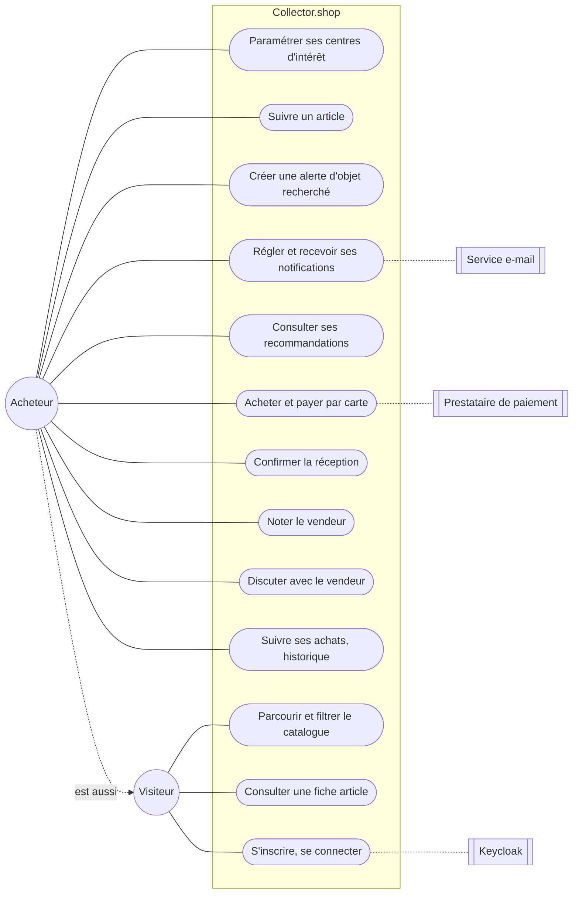
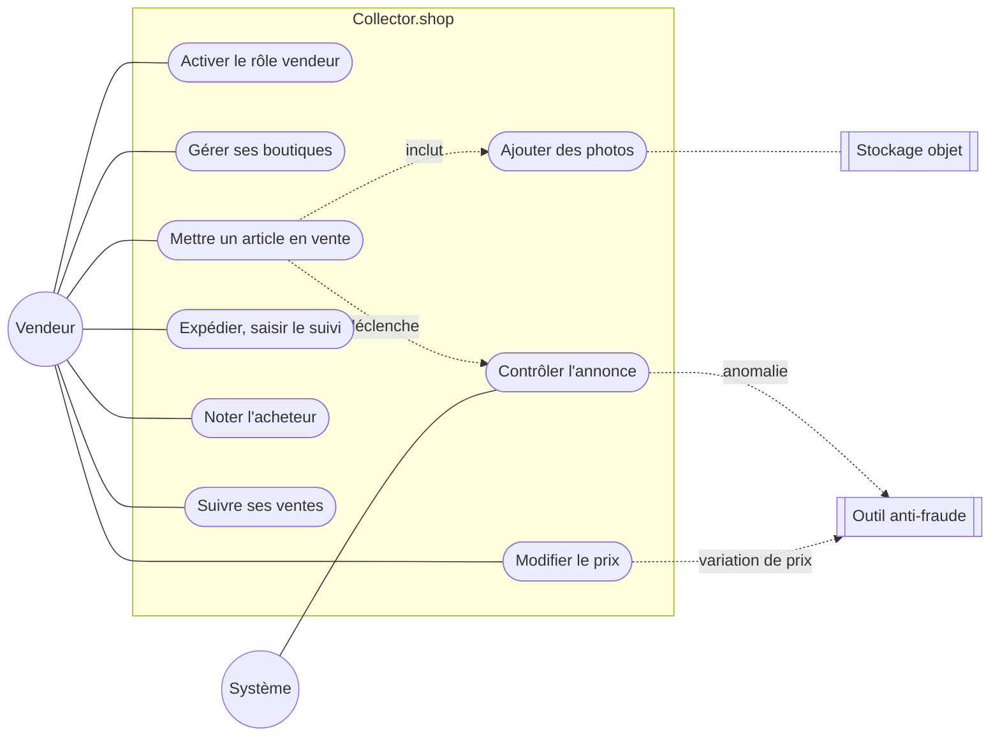
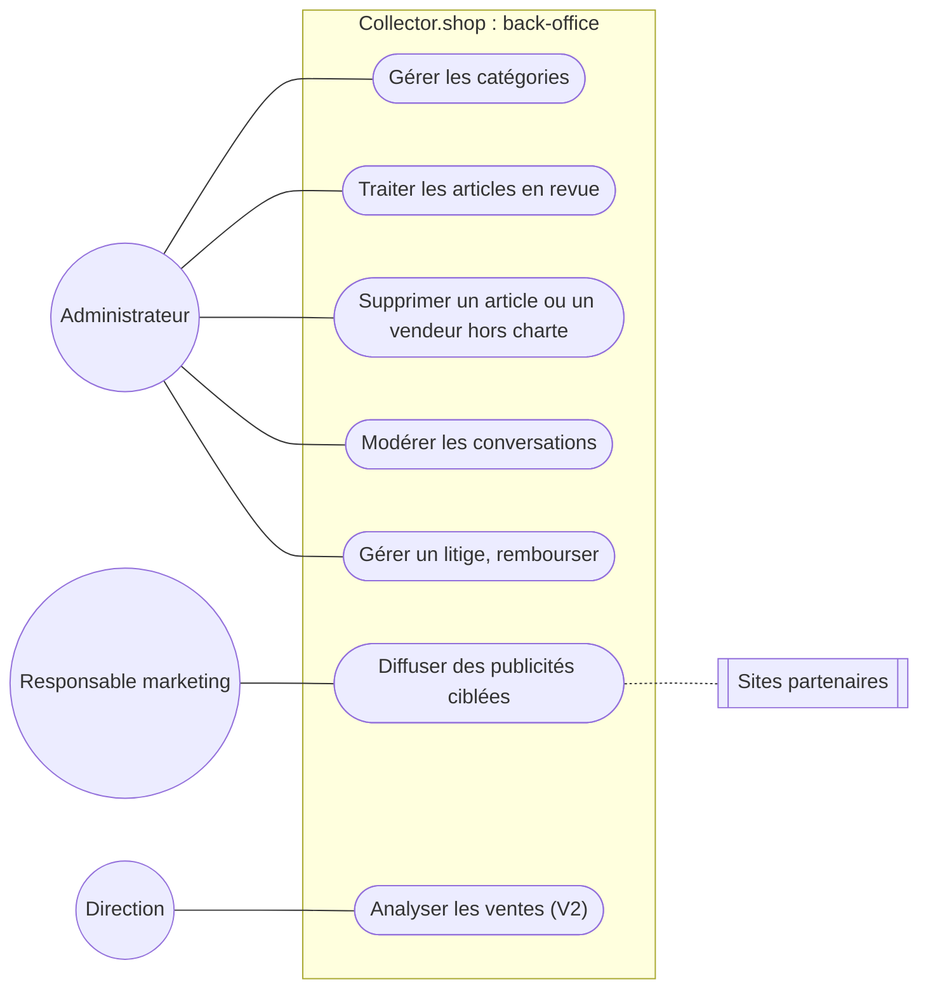

# Collector.shop

Marketplace de vente d'objets de collection **entre particuliers** : baskets en
édition limitée, posters dédicacés, figurines, cassettes vidéo… Les
transactions passent obligatoirement par la plateforme, qui prélève une
commission de 5 % et garantit la qualité des vendeurs et des annonces.

Prototype (POC) réalisé dans le cadre du bloc *Superviser et assurer le
développement des applications logicielles* (CESI, titre MAALSI), dans le rôle
du Lead Developer de la start-up Collector.

**Stack** : Java 21 · Spring Boot 4 · PostgreSQL 16 · RabbitMQ · Keycloak (OIDC) ·
stockage objet S3 · Kubernetes · GitHub Actions.

| Document | Contenu |
|---|---|
| Ce README | Besoin, acteurs, cas d'utilisation, backlog, périmètre du POC |
| [`CLAUDE.md`](CLAUDE.md) | Référence technique complète : architecture, contrats, sécurité, CI/CD, déploiement |
| [`docs/guide/`](docs/guide/exemple-US-021-centres-interet.md) | Exemple guidé : écrire une user story de bout en bout |
| `docs/api/openapi.yaml`, `docs/events.md` | Contrats de l'API et des événements |

---

## Sommaire

1. [Acteurs](#1-acteurs)
2. [Diagrammes de cas d'utilisation](#2-diagrammes-de-cas-dutilisation)
3. [Fiches des cas d'utilisation du POC](#3-fiches-des-cas-dutilisation-du-poc)
4. [Backlog](#4-backlog)
5. [Interprétations du besoin](#5-interprétations-du-besoin)
6. [Périmètre du POC](#6-périmètre-du-poc)
7. [Architecture en bref](#7-architecture-en-bref)
8. [Démarrage rapide](#8-démarrage-rapide)

---

## 1. Acteurs

| Acteur | Type | Description |
|---|---|---|
| **Visiteur** | Humain | Parcourt le catalogue **sans compte** |
| **Acheteur** | Humain | Membre inscrit : achète, suit des articles, note, discute avec les vendeurs |
| **Vendeur** | Humain | Le **même compte** qu'un acheteur, avec le rôle vendeur activé ; toujours identifié comme **vendeur particulier** |
| **Administrateur** | Humain | Back-office : catégories, revue des annonces douteuses, modération, suppressions hors charte |
| **Responsable marketing** | Humain | Publicités ciblées sur des sites partenaires |
| **Direction** | Humain | Analyse des ventes (V2) |
| **Système** | Automatique | Contrôle des annonces, détection d'anomalies, filtrage des coordonnées, notifications, commission |
| **Keycloak** | Système externe | Identité, authentification, rôles |
| **Prestataire de paiement (PSP)** | Système externe | Paiement par carte, certifié PCI-DSS |
| **Outil anti-fraude** | Système externe | Développé en interne **ou acheté** (non tranché) : intégré par événements |
| **Service e-mail** | Système externe | Envoi des notifications par e-mail |
| **Stockage objet** | Système externe | Photos des articles |
| **Sites partenaires** | Système externe | Diffusion des publicités ciblées |

Un acheteur peut faire tout ce que fait un visiteur ; un vendeur, tout ce que fait
un acheteur.

---

## 2. Diagrammes de cas d'utilisation

### 2.1 Visiteur et acheteur



### 2.2 Vendeur et contrôle automatique



### 2.3 Administration, marketing, direction



---

## 3. Fiches des cas d'utilisation du POC

> **Ce README est la référence fonctionnelle** : sa numérotation (US-001 à
> US-037) est celle du code, des tests et du CLAUDE.md. Le deck de soutenance
> (US-01 à US-38) est renuméroté pour s'y aligner ; sa mise en vente US-10 à US-13
> correspond ici à **US-014**. Le **périmètre** du POC vient du deck : **21 user
> stories**, dont le paiement en sandbox et le chat protégé.

### UC-014 — Mettre un article en vente

| | |
|---|---|
| **User story** | En tant que vendeur authentifié, je veux mettre en ligne un article avec son prix et ses photos, afin qu'il soit proposé à la vente après un contrôle automatique de conformité |
| **Acteur principal** | Vendeur |
| **Acteurs secondaires** | Stockage objet, Système (contrôle), Outil anti-fraude |
| **Préconditions** | Le vendeur est authentifié et possède le rôle `vendeur` |
| **Postconditions** | L'article est `PUBLIE` (visible dans le catalogue) ou `EN_REVUE` (en attente d'un administrateur) ; les événements correspondants sont publiés |

**Scénario nominal**
1. Le vendeur saisit un brouillon : titre, description, catégorie, prix, frais de port, attributs.
2. Le système valide les champs, vérifie l'absence de coordonnées personnelles et enregistre l'article au statut `BROUILLON`.
3. Le vendeur demande à ajouter une photo ; le système lui fournit une adresse d'envoi temporaire.
4. Le vendeur envoie la photo directement au stockage objet (l'API ne manipule jamais le fichier).
5. Le vendeur soumet son brouillon.
6. Le système vérifie qu'au moins une photo valide est présente (type, taille), passe l'article au statut `EN_CONTROLE` et publie `article.submitted` (**CA-1**).
7. Le contrôle automatique compare le prix à ceux de la catégorie : il est cohérent (**CA-2**).
8. L'article passe au statut `PUBLIE` en moins de 2 secondes, sans intervention humaine.

**Extensions**
- **2a.** La description ou le titre contient une adresse e-mail ou un numéro de téléphone → refus `contact_info_forbidden` (422).
- **6a.** Aucune photo valide → refus `photo_required` (422), l'article reste `BROUILLON` (**CA-6**).
- **7a.** Le prix s'écarte de plus de 3 écarts-types de la médiane de la catégorie → statut `EN_REVUE` et alerte vers l'anti-fraude (**CA-3**) ; suite : UC-033.
- **7b.** La catégorie compte moins de 30 articles publiés → publication sans conclusion (échantillon insuffisant).
- **7c.** Le contrôle est indisponible → l'article attend `EN_CONTROLE`, il est traité au retour du service ; aucune soumission n'est perdue.
- **\*a.** Utilisateur non authentifié → 401 ; sans le rôle vendeur, ou brouillon d'un autre vendeur → 403 (**CA-5**).

### UC-011 — Contrôler automatiquement une annonce

| | |
|---|---|
| **Acteur principal** | Système (service de contrôle) |
| **Déclencheur** | Événement `article.submitted` |
| **Règle** | score = \|prix − médiane\| / écart-type de la catégorie ; au-delà de 3 → revue |
| **Garanties** | Chaque soumission est traitée au moins une fois ; un traitement en double n'a aucun effet (idempotence) ; un message illisible est isolé (file de lettres mortes) après 5 tentatives |

1. Le service reçoit `article.submitted`.
2. Il lit les statistiques de prix de la catégorie (lecture seule).
3. Il calcule le score et décide : `PUBLIE` ou `EN_REVUE`.
4. En cas d'anomalie, il publie `fraud.alert` vers l'anti-fraude.
5. Il publie son verdict `article.checked` ; le catalogue met à jour le statut.

### UC-012 — Modifier le prix d'un article

| | |
|---|---|
| **Acteur principal** | Vendeur **propriétaire** de l'article |
| **Préconditions** | Article `PUBLIE` ou `EN_REVUE` |
| **Postconditions** | Nouveau prix enregistré, historique conservé, `price.changed` publié |

1. Le vendeur saisit un nouveau prix.
2. Le système enregistre le prix et l'historique de la variation (exigence : « l'information doit être collectée »).
3. Le système publie `price.changed`, reçu **à la fois** par l'anti-fraude et par la notification des acheteurs qui suivent l'article (**CA-4**).

Extensions : article d'un autre vendeur → 403 (**CA-5**) ; article dans un statut
non modifiable → 409 ; prix identique → aucun changement, aucun événement.

### UC-021 — Paramétrer ses centres d'intérêt *(exemple guidé)*

| | |
|---|---|
| **Acteur principal** | Acheteur |
| **Règles** | 10 catégories au plus, doublons ignorés, catégories existantes uniquement, liste vide autorisée |
| **Postconditions** | Liste remplacée, `interests.updated` publié (seulement si elle a changé) |

Démarche complète et code : [`docs/guide/exemple-US-021-centres-interet.md`](docs/guide/exemple-US-021-centres-interet.md).

### UC-016 — Acheter un article *(hors POC, pour situer la suite)*

1. L'acheteur choisit un article publié et paie par carte **via la plateforme**
   (prestataire certifié ; aucun paiement direct entre particuliers).
2. La commande passe `PAYEE` ; l'article n'est plus disponible.
3. Le vendeur expédie et saisit le numéro de suivi : `EXPEDIEE`.
4. L'acheteur confirme la réception : `RECUE` ; le paiement est versé au vendeur,
   **commission de 5 % déduite**.
5. Chacun peut noter l'autre (une seule fois par transaction).

Extensions : pas de confirmation, ou litige → l'administrateur arbitre, remboursement (`REMBOURSEE`).

---

## 4. Backlog

Priorités V1 en MoSCoW (Must, Should, Could). ✅ = dans le POC ; **(à confirmer)**
= probablement dans les 21 US du deck, à vérifier contre sa liste.

| Épopée | ID | User story | Acteur | Priorité | POC |
|---|---|---|---|---|---|
| **E1 Comptes et accès** | US-001 | S'inscrire (obligatoire pour acheter ou vendre) | Visiteur | Must | Keycloak |
| | US-002 | Se connecter, se déconnecter | Membre | Must | ✅ |
| | US-003 | Activer le rôle vendeur | Membre | Must | Rôle Keycloak |
| | US-036 | Choisir sa langue | Membre | Must | Front |
| **E2 Catalogue et boutiques** | US-005 | Créer et gérer les catégories (réservé à l'admin) | Admin | Must | Jeu de données |
| | US-006 | Parcourir et filtrer le catalogue sans compte | Visiteur | Must | ✅ |
| | US-007 | Consulter une fiche article | Visiteur | Must | ✅ |
| | US-008 | Ouvrir plusieurs boutiques | Vendeur | Should | |
| | US-009 | Être affiché comme vendeur particulier | Vendeur | Must | Partiel |
| **E3 Mise en vente et contrôle** | **US-014** | **Mettre en ligne un article après contrôle automatique** — découpée en 014a brouillon, 014b photos, 014c soumission et contrôle, 014d variation de prix | Vendeur, Système | Must | ✅ CA-1 à CA-6 |
| **E4 Achat, paiement, livraison** | US-015 | Commission de 5 % sur chaque transaction | Système | Must | (à confirmer) |
| | US-016 | Payer par carte via la plateforme | Acheteur | Must | Hors POC |
| | US-017 | Expédier et suivre la livraison | Vendeur, Acheteur | Should | |
| | US-018 | Confirmer la réception (libère le paiement) | Acheteur | Must | (à confirmer) |
| | US-019 | Annuler, rembourser, arbitrer un litige | Admin | Should | |
| **E5 Espace personnel et notation** | US-020 | Noter l'autre partie après une transaction | Acheteur, Vendeur | Must | |
| | US-022 | Suivre ses achats et ventes, consulter l'historique | Membre | Must | Partiel |
| **E6 Échanges** | US-023 | Coordonnées jamais exposées ni échangées | Système | Must | ✅ annonces |
| | US-024 | Discuter entre acheteur et vendeur | Membre | Should | Hors POC |
| | US-025 | Modérer les conversations | Admin | Should | |
| **E7 Notifications** | US-026 | Être prévenu d'un nouvel article dans ses centres d'intérêt | Acheteur | Must | Événements prêts |
| | US-027 | Créer une alerte sur un objet recherché | Acheteur | Should | |
| | US-028 | Recevoir ses notifications (espace, e-mail), en régler le type | Acheteur | Must | |
| | US-029 | Suivre un article, être prévenu de ses variations de prix | Acheteur | Must | ✅ |
| **E8 Recommandations** | US-021 | Paramétrer ses centres d'intérêt | Acheteur | Must | ✅ |
| | US-030 | Recevoir des recommandations selon ses centres d'intérêt | Acheteur | Should | |
| | US-031 | Recommandations selon le parcours du catalogue | Acheteur | V2 | |
| **E9 Fraude et qualité** | US-032 | Transmettre annonces et variations de prix à l'outil anti-fraude | Système | Must | ✅ événements |
| | US-033 | Traiter les articles en revue (valider, rejeter) | Admin | Must | ✅ |
| | US-034 | Détecter un vendeur suspect | Système | Should | |
| **E10 Administration** | US-035 | Supprimer un article ou un vendeur hors charte | Admin | Must | |
| **E11 Marketing** | US-037 | Diffuser automatiquement des publicités ciblées chez les partenaires | Resp. marketing | Could | |

**Exigences non fonctionnelles** : sécurité (exigence de premier plan : il y a
des transactions financières) · internationalisation · accessibilité (RGAA) ·
architecture évolutive, pour ajouter rapidement enchères, ventes en direct lors
d'événements, bot avant-vente et analyse des ventes.

---

## 5. Interprétations du besoin

Le sujet laisse certains points ouverts ; voici les choix retenus.

| Formulation du sujet | Interprétation | Conséquence |
|---|---|---|
| « Nouvel article **particulier** » | Alerte sur un objet précis recherché | US-027, distincte des centres d'intérêt (catégories) |
| « Acheteurs ayant de l'intérêt **pour cet article** » | Acheteurs qui **suivent** l'article | US-029 : destinataires de la notification de CA-4 |
| « Collector se charge de la **garantie** du vendeur et de ses produits » | Contrôle des annonces + notation + **paiement retenu jusqu'à la réception** + litiges | Statuts `PAYEE → EXPEDIEE → RECUE`, US-018, US-019 |
| « Contrôle **le plus automatisé possible** » | Contrôle automatique + revue humaine des seuls cas douteux | US-033 : suite de CA-3 |
| Commission de 5 % | Retenue sur le montant versé au vendeur | À confirmer avec la direction |
| « Des photos » | Au moins une photo valide | Seuil à relever à 2 si la direction le souhaite |
| Outil anti-fraude « interne ou acheté » | Intégration par un **contrat d'événement** | Les deux options restent possibles sans changer le catalogue |
| Publicités ciblées sur sites partenaires | Flux automatique d'articles par catégorie | Ciblage soumis au **consentement RGPD** |

---

## 6. Périmètre du POC

**Décision du 30/09/2026 : trois user stories liées**, au lieu des 21 du deck. Le sujet
en impose une (la mise en vente) ; les deux autres en prolongent le cycle de vie et
exercent les deux branches de l'architecture événementielle :

| US | Rôle dans le cycle de vie d'un article | Ce qu'elle démontre |
|---|---|---|
| **US-014** Mettre en ligne un article après contrôle automatique | Brouillon, photos, soumission, contrôle, anomalie de prix, variation de prix (CA-1 à CA-6) | Authentification, persistance, stockage objet, outbox, bus, sécurité |
| **US-033** Traiter les articles en revue | Suite de CA-3 : l'admin valide ou rejette un article `EN_REVUE` | Rôle `admin`, machine à états complète, événement `article.reviewed` |
| **US-029** Suivre un article, être prévenu de ses variations de prix | Suite de CA-4 : les abonnés reçoivent la notification | 2e consommateur de `price.changed`, `notification-service`, idempotence, `aggregate_version` |

En plus, déjà livrés car ils reposent sur le même socle : consultation publique du
catalogue (US-006, US-007), filtrage des coordonnées (US-023, dans les annonces) et
US-021 en exemple guidé.

| Dans le POC | Hors POC |
|---|---|
| US-014, US-033, US-029 (ci-dessus) | Paiement, commission, livraison, litiges (US-015 à US-019) : **retirés du POC** |
| Authentification Keycloak, rôles (vendeur, acheteur, admin), propriété (401 / 403) | Chat (US-024, US-025) : **retiré du POC** |
| Filtrage des coordonnées dans les annonces | Recommandations, e-mail, alertes (US-026 à US-028, US-030) |
| Diffusion des événements vers l'anti-fraude et la notification | Boutiques, autres pages du back-office, publicité |
| Consultation publique du catalogue, US-021 | |

> **Écart avec le deck de soutenance** (31 slides, 21 US dont paiement en sandbox et
> chat protégé) : à mettre à jour avant la soutenance. Le périmètre réduit est un choix
> assumé du développeur : moins de fonctionnalités, mais liées, complètes et testées.

Chaque élément hors POC correspond à un **consommateur d'événements** ou à un
**service** supplémentaire : l'architecture les accueille sans refonte.

---

## 7. Architecture en bref

```
Navigateur (Vue 3) ──HTTPS──► Traefik ──► catalogue-service ──► PostgreSQL
                                 │  │         │  └─► stockage objet (photos)
                                 │  │         ▼ outbox
                                 │  │     RabbitMQ ◄──► controle-service
                                 │  └──► notification-service (abonnements, notifications)
                              Keycloak
```

- **Trois services** Spring Boot reliés par des **événements** : `catalogue-service`
  (API publique : articles, photos, revue admin, suivi), `controle-service` (contrôle
  automatique, [README](services/controle-service/README.md)) et `notification-service`
  (abonnements et notifications de variation de prix). Paiement et chat : hors POC
  (conception conservée, CLAUDE.md §C13).
- **Architecture hexagonale** à l'intérieur de chaque service, vérifiée en CI.
- **Outbox transactionnelle** : une donnée et son événement sont enregistrés
  ensemble.
- **Sécurité** : OIDC (Keycloak), TLS, moindre privilège, images signées,
  aucune donnée de carte chez Collector.

Détails, justifications et alternatives écartées : [`CLAUDE.md`](CLAUDE.md), partie C.

---

## 8. Démarrage rapide

> Les tests d'intégration (`*IT`) utilisent Testcontainers : Docker doit tourner. Sans Docker,
> ils sont ignorés et le seuil de couverture de branches peut ne pas être atteint
> (`./mvnw verify -Djacoco.skip=true` pour un build local sans Docker).

Prérequis : JDK 21, Docker Desktop, et pour Kubernetes `kubectl`, `minikube`,
`helm`. Commandes Bash : terminal sous macOS, Git Bash sous Windows.

```bash
cp .env.example .env               # puis renseigner chaque mot de passe
docker compose up -d --build       # pile complète
./mvnw verify                      # tests unitaires, d'architecture et d'intégration
```

En PowerShell : `Copy-Item .env.example .env` et `.\mvnw verify`.

| Service | Adresse |
|---|---|
| API catalogue (Swagger UI en dev) | http://localhost:8080 |
| API notifications | http://localhost:8082 |
| Keycloak | http://localhost:8081 |
| RabbitMQ | http://localhost:15672 |
| Stockage objet (Garage, API S3) | http://localhost:3900 |
| Grafana | http://localhost:3000 |

Comptes de test (mot de passe `KC_TEST_USER_PASSWORD` du `.env`) : `vendeur1`,
`vendeur2` (175 articles publiés), `acheteur1`, `admin`.
